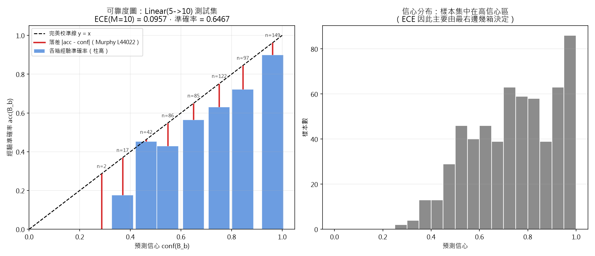
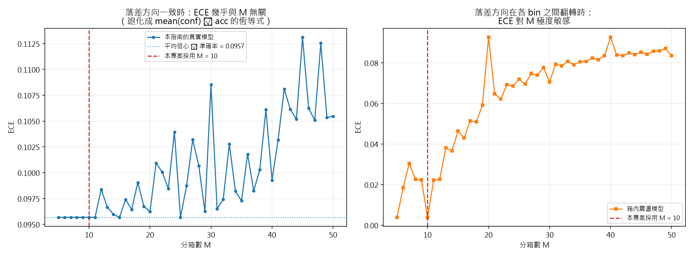
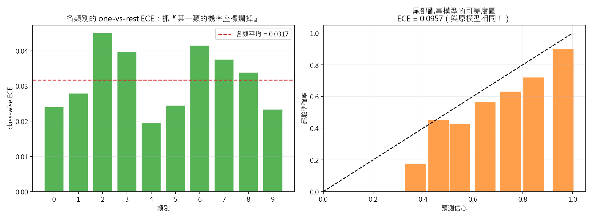
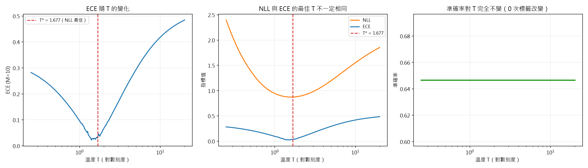
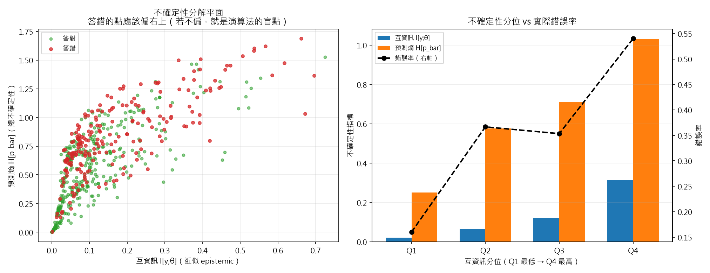
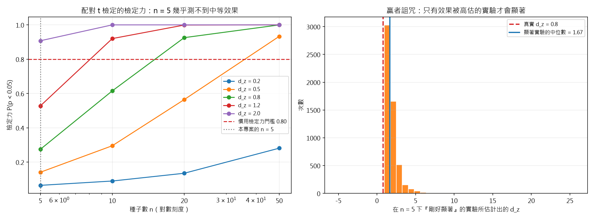
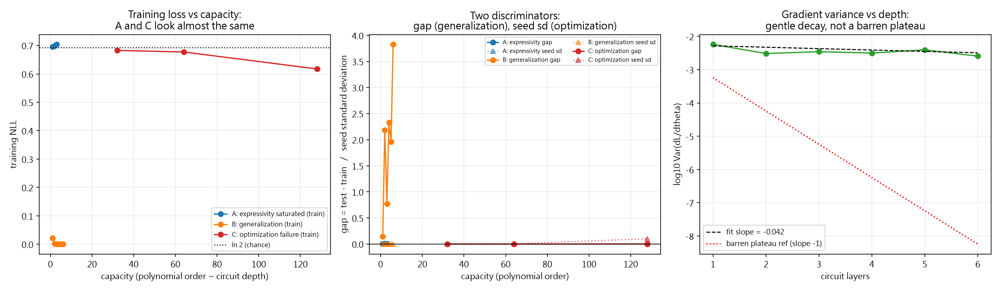

# ML 實作指南：量子分類器的評估、校準與統計

> **對象**：會寫 Python、但沒做過機器學習評估的人（例如物理系同學）。
> **範圍**：本專題中所有「AI／機器學習」而非「物理」的部分 —— 評估指標、校準、
> 不確定性分解、統計推論、基線比較協定。
> **不包含**：量子電路本身的推導（那是 Poyuan Chung 的工作）。
>
> **每一節的程式碼都真的跑過**，貼在下面的輸出是執行後直接複製的，不是手寫的。
> 所有腳本位於 `projects/qbn-capacity-calibration/ml/`，用
> `uv run python <script>.py` 執行（純 NumPy + matplotlib，不需要 CUDA-Q、不需要 WSL）。
> **單一真相來源**：`docs/_summary/00-專案規格常數.md`（ECE 分箱 $M=10$、
> 蒙地卡羅 $T=30$、種子集合 $[7,21,42,84,168]$ 都從那裡來）。

---

## 0. 環境、檔案與執行方式

| 檔案 | 內容 | 產出的圖 |
|---|---|---|
| `mlkit.py` | 共用函式庫（本指南 §2 逐段建立） | — |
| `demo_setup.py` | 統一的示範資料與模型（§2 ~ §5 共用同一顆模型） | — |
| `s01_metrics.py` | §1 評估指標 | — |
| `s02_ece_reliability.py` | §2 ECE 與可靠度圖 | `figs/01`, `02`, `03` |
| `s03_temperature.py` | §3 溫度縮放 | `figs/04` |
| `s04_uncertainty.py` | §4 不確定性分解 | `figs/05` |
| `s05_seeds_stats.py` | §5 統計嚴謹性 | `figs/06` |
| `s06_param_budget.py` | §6 參數量計算器 | — |
| `s07_rq1_diagnostics.py` | §9 RQ1 三機制判別（含純 NumPy 電路模擬器） | `figs/07` |

```bash
cd C:\Users\qq134\source\repos\QBN
uv run python projects/qbn-capacity-calibration/ml/s02_ece_reliability.py
```

實測環境：Windows、Python 3.13.14、NumPy 2.5.3、matplotlib 3.11.2。
**刻意不使用 scikit-learn 與 scipy**，讓整份程式碼在任何環境都能跑
（本機其實裝了 scikit-learn 1.9.1 與 scipy 1.18.1，但我們不想讓讀者被版本綁住；
t 分布的分位數在 `mlkit.student_t_sf` 裡用不完全 beta 函數自己實作了約 25 行）。

### 0.1 為什麼示範用合成資料

本指南示範的是**評估方法**，不是模型能力。合成資料有三個好處：ground truth 完全可控
（可以精確造出「準確率相同但校準不同」的案例）、跑得快（數秒完成）、形狀對齊本專案
（$D=5$ 個 $\langle Z_i\rangle$ 值域 $[-1,1]$、$C=10$ 類，所以分類頭 `Linear(5→10)`
剛好是 **5×10 + 10 = 60 個參數**，與規格書一致）。
**要換成真實資料時，只要把 `X` 與 `y` 換掉，本指南的每一行評估程式都不用改。**

### 0.2 統一示範設定（`demo_setup.py`）

```python
SEED, N_TRAIN, N_VAL, EPOCHS = 42, 300, 600, 2000

def load_demo(seed=SEED, n_train=N_TRAIN):
    X, y, _ = make_readout_dataset(N=3000, C=10, D=5, separation=3.0, noise=1.0, seed=SEED)
    Xtr, ytr = X[:n_train], y[:n_train]
    Xva, yva = X[1800:2400], y[1800:2400]; Xte, yte = X[2400:], y[2400:]
    model = train_softmax(Xtr, ytr, Xva, yva, C=10, seed=seed,
                          epochs=EPOCHS, lr=0.05, batch=64, l2=0.0)
```

**為什麼訓練集只給 300 筆、跑 2000 個 epoch、關掉 L2？** 因為「校準」這個問題只有在
模型**過度自信**時才看得見。訓練集很小 + 訓練很久 + 不正則化，正是現實中深度網路最
常見的過度自信成因。這不是為了讓數字好看，而是為了讓每一節要示範的現象都真的有東西可量。

---

## 1. 評估指標：為什麼準確率不夠

### 1.1 開場：兩個模型準確率都是 95%，但一個是危險的

```python
C, N, SEED = 10, 1000, 20260601
rng = np.random.default_rng(SEED)
y = np.repeat(np.arange(C), N // C)          # 10 類各 100 筆，完全平衡
correct_mask = np.zeros(N, dtype=bool); correct_mask[:950] = True   # 前 950 筆答對
PA = build_model(0.990, 0.004, correct_mask, y, rng)   # 模型 A：不管對錯，一律宣稱 99%
PB = build_model(0.952, 0.008, correct_mask, y, rng)   # 模型 B：信心 ≈ 準確率 95%
```

> **注意**：誠實的模型 B 在**答錯時也是 0.95**。這不是 bug ——「說 95% 就該有 5% 出錯」
> 正是校準的定義。

```
指標                        模型 A（宣稱 99%）   模型 B（誠實）   誰比較好
準確率                             0.9500        0.9500      一樣
平均信心                            0.9900        0.9519    B 較誠實
NLL（越低越好）                     0.3795        0.3080     B 較好
Brier（越低越好）                  0.0990        0.0972     B 較好
ECE（越低越好）                      0.0400        0.0019     B 較好

→ 準確率完全相同（都是 0.9500），但 ECE 差了 21 倍。
拆開看（同一批答錯的 50 筆）：A 的 NLL = 7.3988、B 的 NLL = 5.2254
→ 差距 +2.1734，擴大了 30.4 倍。
```

**A 為什麼危險**：它在**答錯時仍然宣稱 99% 確定**。真類別被壓到
$(1-0.99)/9 \approx 0.0011$，$-\log(0.0011) \approx 6.8$。在需要依信心做決定的場合
（拒答、轉人工、加做實驗），A 會讓你在**最沒把握的地方最有把握**。

還有一個必學的閱讀技巧：**平均 NLL 會把危險模型洗白**。A 的整體 NLL 只比 B 差 0.07，
因為 95% 的答對樣本稀釋了 5% 的災難；只看那 50 筆答錯的樣本，差距是 **+2.17**（30 倍）。
→ **除了總平均，一定要拆開看「答錯子集」的指標。**

### 1.2 類別不平衡時，準確率會說謊

```python
yb = np.array([1] * 50 + [0] * 950)        # 1 = 少數類（5%）
P_lazy = np.zeros((1000, 2)); P_lazy[:, 0] = 1.0   # 永遠說「負類」，而且 100% 確定
P_good = ...   # 混淆矩陣：TP=30, FN=20, FP=60, TN=890
```

```
測試集：950 筆負類 + 50 筆正類（正類佔 5.0%）
模型              準確率     精確率     召回率      F1
永遠說「負類」      0.9500   0.0000   0.0000   0.0000
真的有在分類       0.9200   0.3333   0.6000   0.4286
```

懶惰分類器準確率 **95%**，召回率 **0**、F1 **0** —— 它一筆正類都沒抓到。真的在做事的
模型準確率只有 **92%（比較低）**，卻抓到了 60% 的正類。**只看準確率，你會挑錯模型。**

$$\text{precision}_c=\frac{TP_c}{TP_c+FP_c},\quad
\text{recall}_c=\frac{TP_c}{TP_c+FN_c},\quad F1_c=\frac{2PR}{P+R}$$

三種平均要分清楚：**macro**（各類等權，抓少數類）、**weighted**（按 support 加權，
接近準確率）、**micro**（＝準確率）。**類別不平衡時一律報 macro-F1**
（`prf_per_class()` 三種都回傳）。

### 1.3 NLL 是嚴格評分規則，準確率不是

**定義**（Murphy, *Advanced Topics*, L43955–L43969）：$S(p_\theta,p^*)\le S(p^*,p^*)$，
等號若且唯若 $p_\theta=p^*$。白話：**只有誠實報告機率才能拿到最好分數。**
多類別 NLL（＝交叉熵，Murphy *An Introduction* L27190）：

$$\mathrm{NLL}=-\frac{1}{N}\sum_n \log P[n,y_n]$$

它是嚴格評分規則（由 Gibbs 不等式，F4 L13976），**最小值唯一地在「$P$ 等於真實機率」
時達成**。準確率完全沒有這個性質 —— 它只看 argmax。

**實際輸出**（$p^*=(0.60,0.25,0.10,0.05)$）：

```
(a) 只看單一筆已實現結果（真實標籤剛好是類別 0）：
報告方式                             NLL     Brier       q_0   top-1
誠實  q = p*                  0.5108    0.2350    0.6000       0
過度自信（往 0/1 推）               0.1181    0.0224    0.8886       0
過度保守（往均勻推）                  0.8557    0.4462    0.4250       0
  ⚠ 注意：過度自信的 NLL 反而最低！因為這一筆剛好答對了。

(b) 對真實分布 p* 取期望（這才是 proper scoring rule 的定義）：
誠實 q = p* → E[NLL] 1.0331、E[Brier] 0.5650
過度自信    → E[NLL] 1.4239、E[Brier] 0.6813
過度保守    → E[NLL] 1.1291、E[Brier] 0.6112
```

**這是本節最重要的一課**：單一樣本的分數有運氣成分。誠實報告的
$\mathbb{E}[\mathrm{NLL}]=1.0331$ 正好等於真實分布的熵 $\mathbb{H}(p^*)=1.0331$；
任何偏離 $p^*$ 的報告方式，期望分數都更差。
**所以評分規則的「嚴格」是對期望值而言的，不是對單一筆而言的。**

### 1.4 Brier score：有界，和 NLL 互補

$$\mathrm{BS}=\frac{1}{N}\sum_n\sum_c \big(P[n,c]-\mathbb{1}[y_n=c]\big)^2
\qquad\text{（Murphy \textit{An Introduction} L13992）}$$

> **慣例陷阱**：*Advanced Topics* 式 14.16（L43977）寫成
> $S\triangleq-\frac{1}{C}\sum_c(p_\theta(y=c|x)-\mathbb{I}(y=c))^2$ ——
> **多了「除以 $C$」與一個負號**（他讓分數越大越好）。兩者只差常數，但**報 Brier 時
> 一定要寫清楚用哪個慣例**，否則 0.28 與 0.028 會被誤讀成差兩個數量級。
> `brier()` 預設回傳 L13992 的慣例，`divide_by_C=True` 可切換。

**與 NLL 的差別：Brier 有界、NLL 無界。**

```
    真類別被給的機率 p   NLL = -log p   Brier（單筆, C=4）
          9e-01        0.1054         0.013333
          1e-01        2.3026         1.080000
          1e-03        6.9078         1.330668
          1e-12       27.6310         1.333333
```

$p\to 0$ 時 NLL $\to\infty$，Brier 飽和在 $2$（除以 $C$ 後是 $2/C$）。
> **實務結論**：如果你的模型偶爾會把正確類別壓到極低機率，**NLL 會被那幾筆支配**。
> 兩者一起報：**Brier 看整體、NLL 看尾端災難。**

### 1.5 小結：什麼樣的指標會被騙

```
模型              準確率     ECE      NLL    Brier
誠實（說 0.95）    0.9500  0.0000  0.1985  0.0950
吹牛（說 0.999）   0.9500  0.0490  0.3463  0.0998
```

準確率一模一樣；**ECE / NLL / Brier 一致地把吹牛的那個抓出來。** 本專案的指標組合：

| 指標 | 抓什麼 | 必報 |
|---|---|---|
| 準確率 | 整體正確率（**會說謊**） | ✅（但不夠） |
| macro-F1 | 類別不平衡下的少數類 | ✅ |
| NLL | 尾端災難、嚴格評分規則 | ✅ |
| Brier | 整體機率品質、有界 | ✅ |
| ECE (M=10) | 校準（§2） | ✅ **核心** |
| MCE | 非 top-1 類別的校準（§2.6） | ✅ |
| 不確定性分解 | aleatoric／epistemic（§4） | ✅ |

> ⚠ **與基準論文的差距**：Wang et al. (2026) **全文沒有使用 NLL 與 Brier**
> （F3 抽取檔的「指標揭露狀況」表明確標示 ❌）。所以本專案報這三個指標
> **是我們自己加上去的嚴謹度**，不能寫成「沿用該論文的做法」。

---

## 2. ECE 與可靠度圖（本指南的核心）

### 2.1 定義：用正確的 $N$ 分母

**分箱**（Murphy L44008）：信心區間 $[0,1]$ 均分為 $M$ 個等寬 bin，$\mathcal{B}_b$ 為
信心落在 $I_b=\left(\frac{b-1}{M},\frac{b}{M}\right]$ 的樣本索引集。其中
$\hat y_n=\arg\max_c f(x_n)_c$、$\hat p_n=\max_c f(x_n)_c$（L44010）。

$$\mathrm{acc}(\mathcal{B}_b)=\frac{1}{|\mathcal{B}_b|}\sum_{n\in\mathcal{B}_b}\mathbb{1}[\hat y_n=y_n]
\ \text{（14.17, L44012）}\qquad
\mathrm{conf}(\mathcal{B}_b)=\frac{1}{|\mathcal{B}_b|}\sum_{n\in\mathcal{B}_b}\hat p_n
\ \text{（14.18, L44018）}$$

$$\boxed{\ \mathrm{ECE}(f)=\sum_{b=1}^{M}\frac{|\mathcal{B}_b|}{N}\big|\mathrm{acc}(\mathcal{B}_b)-\mathrm{conf}(\mathcal{B}_b)\big|\ }
\qquad\text{（式 14.19，L44024）}$$

> **⚠ 分母的坑（本專案必查項目）**：抽取檔 F5（L405–L406）把式 14.19 的分母錄成
> **$B$（bin 數）**，並自行註明「此為 OCR 疑點，實作前務必回查 PDF」。
> **$B$ 在數學上不可能成立**：$|\mathcal{B}_b|$ 是樣本數，加總起來是 $N$ 不是 $B$。
> 下方 §2.3 會把兩個版本都算出來。`TODO(核實)`：回查 Murphy 原書第 14 章 PDF。

**實作**（`mlkit.py`）：

```python
def _bin_index(conf, M):
    """等寬分箱：信心落在 I_b = ((b-1)/M, b/M] 者歸入第 b 箱，回傳 0-based 索引。"""
    conf = np.clip(np.asarray(conf, float), 0.0, 1.0)
    idx = np.ceil(conf * M).astype(int) - 1
    return np.clip(idx, 0, M - 1)     # 夾住邊界：信心恰為 0 時 ceil(0)=0 會落到 -1

def ece(P, y, M=10, denominator="N"):
    rb = reliability_bins(P, y, M)
    counts, gaps = rb["count"].astype(float), rb["gap"]
    denom = float(y.size) if denominator == "N" else float(M)   # "B" 只為重現 OCR 版本
    return float((counts / denom * gaps).sum())
```

> **分箱邊界的實作分歧**：本指南用 $\lceil \hat p M\rceil-1$（對應
> $I_b=(\frac{b-1}{M},\frac{b}{M}]$）。scikit-learn 的 `calibration_curve` 用
> `np.digitize`，邊界慣例不同，小資料集上會給出不同的 ECE。
> **論文裡必須寫死你用哪一種。** 這是「同一份程式碼兩個答案」的典型來源。

### 2.2 可靠度圖：一張圖看完校準

Murphy L44022：橫軸為分箱平均信心、縱軸為箱內經驗準確率，**加對角線**；
紅色長條表示 $|\mathrm{acc}-\mathrm{conf}|$。

**實際輸出**（示範模型，測試集 600 筆）：

```
 bin      信心區間     樣本數   平均信心   經驗準確率     落差
   3    (0.2, 0.3]       2   0.2860    0.0000  0.2860
   4    (0.3, 0.4]      17   0.3691    0.1765  0.1926
   5    (0.4, 0.5]      42   0.4625    0.4524  0.0101
   6    (0.5, 0.6]      86   0.5476    0.4302  0.1173
   7    (0.6, 0.7]      85   0.6495    0.5647  0.0848
   8    (0.7, 0.8]     122   0.7508    0.6311  0.1196
   9    (0.8, 0.9]      97   0.8442    0.7216  0.1226
  10    (0.9, 1.0]     149   0.9621    0.8993  0.0628

→ 8 個非空 bin 之中，有 8 個的經驗準確率低於平均信心。
```

模型整體：**準確率 0.6467、平均信心 0.7423**（差 +0.0957）、NLL 0.9442、
Brier 0.4753、**ECE(M=10) = 0.0957**。



*圖 `figs/01_reliability_diagram.png`：左為可靠度圖（藍柱＝各箱經驗準確率、
紅線＝落差、黑虛線＝完美校準線），右為信心分布。信心幾乎全擠在高信心區
→ **ECE 幾乎只由最右邊幾箱決定**。*

**完整的 matplotlib 實作**（節錄自 `s02_ece_reliability.py`）：

```python
rb = reliability_bins(P, y, M=10)          # 回傳 conf / acc / count / gap 四條陣列
fig, axes = plt.subplots(1, 2, figsize=(13, 5.6))
ax = axes[0]
ax.plot([0, 1], [0, 1], "k--", lw=1.4, label="完美校準線 y = x")        # ← 對角線
ax.bar(rb["conf"], rb["acc"], width=0.085, alpha=0.75, color="#3b7dd8",
       edgecolor="white", label="各箱經驗準確率（柱高）")
for c_, a_, n_ in zip(rb["conf"], rb["acc"], rb["count"]):
    ax.plot([c_, c_], [a_, c_], color="#d62728", lw=2.2)               # ← 落差長條
    ax.annotate(f"n={n_}", (c_, max(a_, c_) + 0.03), ha="center", fontsize=7.5)
ax.plot([], [], color="#d62728", lw=2.2, label="落差 |acc - conf|（Murphy L44022）")
ax.set_xlim(0, 1.05); ax.set_ylim(0, 1.05); ax.grid(alpha=0.25)
ax.set_xlabel("預測信心 conf(B_b)"); ax.set_ylabel("經驗準確率 acc(B_b)")
ax.set_title(f"可靠度圖：Linear(5->10) 測試集\nECE(M=10) = {ece(P, y, 10):.4f}")
ax.legend(loc="upper left", fontsize=8.5)

ax = axes[1]                                # 右圖：信心直方圖（看分箱樣本密度）
ax.hist(confidence(P), bins=np.linspace(0, 1, 21), color="#8c8c8c", edgecolor="white")
ax.set_xlabel("預測信心"); ax.set_ylabel("樣本數"); ax.grid(alpha=0.25, axis="y")
fig.tight_layout(); fig.savefig("figs/01_reliability_diagram.png", dpi=150)
```

> **中文字型**：matplotlib 預設字型沒有中文，會畫成空白方塊。在
> `demo_setup.fig_font_setup()` 裡設 `font.sans-serif = ["Microsoft JhengHei", ...]`
> 與 `axes.unicode_minus = False` 即可。（本機可用的中文字型已實測：Microsoft JhengHei、
> Microsoft YaHei、MingLiU、SimHei。）

### 2.3 分母是 $N$ 還是 $B$？實際算給你看

```
ECE（分母 N = 600，正確）      = 0.095682
ECE（分母 B = 10，OCR 版本）   = 5.740896
放大倍率 = N / B = 600 / 10 = 60.0 倍
```

**除以 $B$ 的後果不是「縮小 $M$ 倍」，而是 ECE 會隨測試集大小膨脹**：同一顆模型換到
10 倍大的測試集，分母 $B$ 不變，ECE 就變成 10 倍。這種指標既不能跨論文比較，
也不能用來判斷「校準好不好」。
**本專案一律採 $\mathrm{ECE}=\sum_b\frac{|\mathcal{B}_b|}{N}|\mathrm{acc}-\mathrm{conf}|$，
並在論文中寫死。**

### 2.4 ECE 對分箱數 $M$ 的敏感度

先看一個**很重要、但很少被講清楚的恆等式**：

```
先看一個重要事實：平均信心 − 準確率 = 0.742348 − 0.646667 = 0.095682
                  ECE (M=10)                        = 0.095682
                  兩者相差 2.78e-17
```

> **當模型在每一個 bin 都過度自信（$\mathrm{acc}_b<\mathrm{conf}_b$）時**，絕對值裡的
> 每一項同號，$|\sum|=\sum|\cdot|$，於是
> $\mathrm{ECE}=\overline{\mathrm{conf}}-\mathrm{accuracy}$，**完全與 $M$ 無關。**

本模型 8 個 bin 全部 $\mathrm{acc}<\mathrm{conf}$，所以 $M=5\ldots11$ 的 ECE 一模一樣；
$M=10$ 時 0.095682、$M=50$ 時 0.105467，最小 0.095682（M=9）／最大 0.113109（M=45），
極差 0.017428（只佔 M=10 值的 18.2%）。**但方向一旦在不同 bin 之間翻轉，
$M$ 的影響就會非常大** —— 用 §2.5 的「箱內震盪」模型實測（$M=5\ldots50$），
最小 0.003904（M=10）／最大 0.092538（M=20），極差 0.088634（是 M=10 值的 22.7 倍）：

| 模型 | $M=5\ldots50$ 的 ECE 範圍 | 極差 |
|---|---|---|
| 真實模型（落差同號） | **0.0957 ~ 0.1131** | 0.0174 |
| 震盪模型（落差反覆變號） | **0.0039 ~ 0.0925** | 0.0886 |



*圖 `figs/02_ece_bin_sensitivity.png`：左＝落差同號時 ECE 幾乎與 $M$ 無關（退化成
$\overline{\mathrm{conf}}-\mathrm{acc}$ 的恆等式）；右＝落差反覆變號時 ECE 對 $M$ 極度敏感。*

→ **論文中報 ECE 一定要寫明 $M$。** 本專案固定 $M=10$（採 Wang et al. 2026，
F3 抽取檔【L490】），並在附錄附上這張敏感度曲線。

### 2.5 ECE 的兩種偏差：有限樣本「高估」、分箱抹平「低估」

**偏差一：有限樣本雜訊 → ECE 被高估。** 模擬：真實機率
$p^*\sim\mathrm{Dirichlet}$，標籤 $y\sim\mathrm{Categorical}(p^*)$ ——
這樣造出來的模型**在母體上完美校準**，理論 ECE $=0$。

```
     樣本數 N      重複次數      平均 ECE(M=10)         標準差
       100       400           0.06712     0.02711
      1000       400           0.02141     0.00893
     10000       200           0.00646     0.00279
     50000        60           0.00301     0.00133
```

> **硬約束**：$N=100$ 時光是雜訊就貢獻約 **0.067** 的 ECE —— 比很多論文報的「改進量」
> 還大。所以「A 模型 ECE 0.012、B 模型 ECE 0.009」在幾百筆的測試集上**可能純屬雜訊**。
> 必須（a）用足夠大的測試集，（b）對 ECE 本身做自助法信賴區間（§5）。

**偏差二：分箱把箱內的校準曲線抹平 → ECE 被低估。** 構造「箱內震盪」模型：
信心 $s\sim U(0.5,1)$，在信心 $s$ 之下答對的機率 $w(s)=s+A\sin(2\pi\cdot10\cdot s)$，
$A=0.15$。真實校準誤差 $\mathbb{E}|w(s)-s|=0.0921$ 是固定的。

```
     M        箱寬        分箱 ECE        低估比例
     5     0.200      0.003904       95.8%
    10     0.100      0.003904       95.8%
    20     0.050      0.092538       -0.4%
   100     0.010      0.092538       -0.4%
```

$M=5$ 與 $M=10$ 時分箱 ECE 只有真實值的**幾個百分點** —— 因為 $\sin$ 的週期（0.1）
正好是箱寬的整數倍，箱內正負互相抵消。
> **兩個偏差方向相反、都隨 $M$ 變化。** 這就是為什麼 ECE 不是絕對真理，
> 只能當「同一個 $M$、同一份測試集下的相對比較」。

### 2.6 ECE 只看 top-1 的後果：MCE 與 class-wise ECE

Murphy L44028 明確指出：**多類別情形下 ECE 只看 MAP（top label）預測的誤差。**
做一個實驗：把非 top-1 的機率全部塞給「下一個類別」，同時保證 top-1 標籤不變。

```
構造檢查：每列機率和 ∈ [1.000000, 1.000000]；max_c P 的最小值 = 0.2822
          top-1 標籤是否完全沒變：True

模型                                   準確率       ECE         MCE       NLL
原模型（合理分配剩餘機率）                   0.6467    0.0957    0.005265    0.9442
尾部亂塞（top-1 完全相同）                0.6467    0.0957    0.009739    6.1745
```

**兩者的 top-1 標籤、準確率、ECE 完全相同**，但 NLL 從 0.9442 暴增到 6.1745，
MCE 也放大 1.8 倍。→ **本專案必須同時報 ECE 與 MCE**
（Murphy L44030–L44038；[Nix+19] 已展示 ECE 好但 MCE 差的案例，L44038）。

**MCE 的定義**（式 14.20–14.21，L44030）：

$$\mathrm{MCE}=\sum_{c=1}^{C}w_c\sum_{b=1}^{B}\frac{|\mathcal{B}_{b,c}|}{N}
\big(\mathrm{acc}(\mathcal{B}_{b,c})-\mathrm{conf}(\mathcal{B}_{b,c})\big)^2,\qquad w_c=\tfrac{1}{C}$$

它對**每一個類別**各做一次 one-vs-rest 的分箱校準，再把**平方**落差依類別權重加總。

```
class-wise ECE（one-vs-rest：每一類用自己的機率 P[:,c] 對 1[y=c] 分箱）：
  類別   :        0       1       2       3       4       5       6       7       8       9
  ECE_c  :   0.0240  0.0279  0.0450  0.0397  0.0196  0.0245  0.0415  0.0376  0.0339  0.0234
  max = 0.0450（類別 2）／min = 0.0196（類別 4）／平均 = 0.0317
```

> **⚠ 不要把 $\mathrm{ECE}_c$ 與整體 ECE 直接比大小**：整體 ECE 看的是 $\max_c P$
> （top-1 信心），$\mathrm{ECE}_c$ 看的是 $P[:,c]$ 這個座標。它的用途是**相對比較**：
> 哪一類的機率座標最不校準。本模型 max/min 差 2.3 倍，類別 2 最差 → 去查那一類的樣本。

> **⚠ 也常見一個錯誤定義**：把「只取真實標籤為 $c$ 的子集」當成 class-wise ECE。
> 那樣 $\mathbb{1}[y=c]$ 恆為 1，$\mathrm{acc}(\mathcal{B})$ 全部等於 1，
> $\mathrm{ECE}_c$ 退化成 $1-\overline{P[:,c]}$，完全失去意義。本指南的
> `classwise_ece()` 刻意用 **one-vs-rest 全樣本**版本，與 MCE 一致。



### 2.7 已知問題總整理（直接抄進 limitation）

對分箱數 $M$ 敏感（§2.4 實測，$M=5\ldots50$ 極差 0.0174）；有限樣本**高估**
（§2.5 實測，$N=100$ 時偏 +0.067）；分箱抹平**低估**（§2.5 實測，$M=10$ 時低估 95.8%）；
只看 top-1（L44028，必須補報 MCE）；分布偏移下失效（L44125，[Ova+19]）。
→ 對策：固定 $M=10$ 並附敏感度曲線、測試集要夠大且對 ECE 做自助法 CI、
同時報 NLL／Brier 與 MCE、誠實聲明必備分布偏移那一句。

---

## 3. 溫度縮放：決定論文成敗的防禦點

### 3.1 定義與實作

$$\boldsymbol q=\mathrm{softmax}(\boldsymbol z/T),\qquad T>0
\qquad\text{（Murphy L44058，[Guo+17]）}$$

$T$ 只有**一個純量**，在**驗證集**上以最大似然估計 —— 也就是最小化驗證集 NLL。
作用是把分布變得「不那麼尖（less peaky）」。

```python
def apply_temperature(logits, T):
    return softmax(np.asarray(logits, float) / float(T))

def fit_temperature(logits_val, y_val, grid=None, refine=True):
    """先粗算對數網格 [0.05, 50]，再在最佳點附近做黃金分割細修。"""
    grid = np.exp(np.linspace(math.log(0.05), math.log(50.0), 400))
    nlls = np.array([nll(apply_temperature(logits_val, t), y_val) for t in grid])
    best = float(grid[int(nlls.argmin())])
    ...   # 黃金分割 refine，見 mlkit.py
    return best
```

三個必踩的坑：
1. **只能用驗證集。** 用測試集調 $T$ 就是資料洩漏。
2. $T$ 是單一純量，**不可能造成嚴重過擬合** —— 這是它比矩陣縮放
   （$\boldsymbol q=\mathrm{softmax}(\mathbf W\boldsymbol z+\mathbf b)$，$K\times K$
   參數）安全的主因（Murphy L44046）。
3. $T$ 只改變機率，**不改變 argmax**（見 §3.2）。

### 3.2 關鍵事實：不改變 top-1 標籤（Murphy L44113）

```
掃描 T ∈ [0.2500, 20.0000]，共 240 個值
其中 top-1 標籤與 T=1 不同的次數：**0 次**
準確率的取值集合：[0.6466666667]  ← 只有一個值
```

**為什麼保證不變？** softmax 是單調的：對固定的 $\boldsymbol z$，

$$\arg\max_c \mathrm{softmax}(\boldsymbol z/T)_c=\arg\max_c z_c
\qquad\text{對所有 }T>0\text{ 都成立}$$

除以正數只會重新縮放 logits，不改變它們的大小順序。

> ### ★ 由此推出的實驗要求（本專案硬規則）
> 溫度縮放是「**零準確率損失改善校準**」的免費午餐。反過來說：
> **任何「我們的模型校準比較好」的主張，只要對手也能做溫度縮放，
> 就必須贏過已經縮放過的對手。**
> **RQ2（去相位消融）的每一組對照，都要同時報未校準與溫度縮放後兩組 ECE。
> 只報未校準的那一組不算數。**

### 3.3 學習 $T$ 與實際效果

```
T*（驗證集 NLL 最佳）        = 1.6766
T（驗證集 ECE 最佳）         = 1.4533
T（測試集 ECE 最佳，僅供對照，實務不可用）= 1.4010

                             準確率       ECE       NLL     Brier
未校準（T=1）                0.6467    0.0957    0.9442    0.4753
溫度縮放 T*=1.677           0.6467    0.0368    0.8730    0.4633
T=1.401（ECE 最佳）         0.6467    0.0223    0.8774    0.4623
```

**準確率三列完全相同（0.6467）**；ECE 從 **0.0957 降到 0.0368（61.5% 降幅）**。

> **★ 誠實提醒**：**溫度縮放最小化的是 NLL，不是 ECE。** ECE 的改善是副產品 ——
> 注意 ECE 自己最喜歡的 $T=1.401$ 能到 0.0223，比 $T^*=1.677$ 的 0.0368 更好。
> Murphy（L44056–L44113）引用的 [Guo+17] 觀察到它在多個 DNN 上「剛好」也拿到最低
> ECE，**但這不是定理。** 所以本專案必須同時報 NLL 與 ECE，不能只挑一個講。
> 也**不可以**用測試集去挑 $T$；上表第三列只是示範，不能寫進論文。



*圖 `figs/04_temperature_scaling.png`：左＝ECE(T) 曲線；中＝NLL 與 ECE 的最佳 $T$
不一定相同；右＝**準確率對 $T$ 是水平線**（240 個 $T$ 值、0 次標籤改變）。*

### 3.4 論證檢查表：你必須贏過哪一格

```
  [1] 你的量子模型（未校準）ECE      = ______   （本示範：0.0957）
  [2] 你的量子模型（溫度縮放後）ECE  = ______   （本示範：0.0368）
  [3] 古典基線（未校準）ECE          = ______
  [4] 古典基線（溫度縮放後）ECE      = ______   ← **這一格才是你的對手**
```

* 若 **[2] < [4]** → 可以寫：「在相同校準後處理下，量子層帶來更好的校準。」
* 若只比 **[1] < [3]** → 只能寫：「我們的模型沒做校準後處理，對手也沒做。」
  後者會被一句話打掉：**「你只是沒做溫度縮放而已。」**

額外要求：[4] 也要用**同一個驗證集**擬合 $T$（不能各擬各的），而且去相位前後的兩個
模型必須共用同一組資料切分。

### 3.5 溫度縮放不是萬靈丹

只調整「整體的尖銳程度」（一個純量），因此：**修不了**類別條件失準（同一信心下不同
類別的準確率不同）、**修不了**分布偏移（Murphy L44125）、**修不了**箱內震盪型的失準
（§2.5 偏差二）、**對準確率一點幫助都沒有**；只修得了「整條可靠度曲線一起被過度放大」
這種最常見的失準。

**實測一個 $T$ 治不了的例子**：把 logits 做跟類別有關的變形（前 5 類乘 1.6 變尖、
後 5 類乘 0.6 變平）：

```
                                   準確率       ECE       NLL
類別條件失準（T=1）                   0.4583    0.4218    3.3955
類別條件失準 + 全域 T*=4.820          0.4583    0.1053    1.3663
── 對照組 ──
原本的均勻失準（T=1）                  0.6467    0.0957    0.9442
原本的均勻失準 + 全域 T*               0.6467    0.0368    0.8730

→ 均勻失準：全域 T* 讓 ECE 從 0.0957 降到 0.0368（降 61.5%）。
→ 類別條件失準：全域 T* 讓 ECE 從 0.4218 降到 0.1053，雖然也降了 75.0%，
  但**剩下的殘量 0.1053 仍是均勻失準修好後（0.0368）的 2.9 倍**。
```

> 這正是「量子層若真能改善校準，就不只是等價於一個溫度參數」的論證骨架：
> **你要能指出溫度縮放結構上做不到的那種改善。** ⚠ 反過來也要誠實：如果你的量子層
> 改善**剛好等於一個 $T$**，那就必須承認「這個改善可以被一個純量的校準後處理取代」。

---

## 4. 不確定性分解

### 4.1 怎麼生出 $T=30$ 個預測分布

本專案取樣不確定性的來源有兩種（F3 抽取檔 §4.1 第 12 項）：**(a)** 把量子電路的變分
參數 $\theta$ 本身當隨機變數（貝氏／變分 ansatz）；**(b)** 對 $\theta$ 做擾動，
或用 bootstrap 重抽訓練集訓多個成員。本節用 (b) 的**自助聚合集成**示範，
協定與量子版完全一樣：跑 $T$ 次前向、逐次 softmax、再平均。

```python
T_MC = 30                                    # 本專案規格常數（F3【L470】）
rng = np.random.default_rng(1234)
members = []
for t in range(T_MC):
    idx = rng.integers(0, Xtr.shape[0], size=Xtr.shape[0])   # bootstrap 重抽
    members.append(train_softmax(Xtr[idx], ytr[idx], Xva, yva, C=10, seed=1000 + t, ...))

P_samples = np.stack([softmax(logits_of(m, Xte)) for m in members], axis=0)   # (T, N, C)
P_bar = P_samples.mean(axis=0)
```

```
已訓練 30 個集成成員（T = 30）。
P_samples 形狀 = (30, 600, 10)   （T, N, C）
```

> **⚠ 順序很重要**：**先逐次 softmax 再平均**，不是先平均 logits 再 softmax。
> F3 抽取檔式 (9)(10)【L472】【L478】特別註明這點。

### 4.2 三個指標的定義與實測

$$\text{(i) 預測熵}\quad \mathbb{H}[\bar p]=-\sum_c \bar p_c\log \bar p_c,
\qquad \bar p=\frac{1}{T}\sum_t p_t$$

$$\text{(ii) 互資訊（BALD）}\quad I[y;\theta]=\mathbb{H}[\bar p]
-\frac{1}{T}\sum_t \mathbb{H}[p_t]
\qquad\text{(iii) 變異比}\quad \mathrm{VR}=1-\frac{\text{眾數標籤票數}}{T}$$

```
指標                                平均        最小        最大
預測熵 H[p_bar]               0.6419    0.0011    1.6866
互資訊 I[y;θ]                  0.1298    0.0002    0.7251
變異比 VR                      0.1531    0.0000    0.7000

檢查 1：互資訊是否非負？ min(I) = 2.168e-04
檢查 2：I ≤ H[p_bar]？ True
檢查 3：變異比的解析度。T = 30 時 VR 只能取 [0.0, 0.0333, 0.0667, 0.1, 0.1333, 0.1667] ...
        等 21 種值 → 解析度是 1/T = 0.0333，很小但**離散**。
```

**兩個必做的自我檢查**（寫進程式裡，不要靠眼睛）：$I\ge 0$（Jensen 不等式：平均的熵
$\ge$ 熵的平均；出現明顯負值通常是浮點誤差或 $p_t$ 沒有正規化），以及
$I\le \mathbb{H}[\bar p]$（互資訊是總不確定性的一部分）。

### 4.3 ⚠ 出處警告：加法分解式不是 Murphy 的

很多論文與教學投影片會寫：

$$\mathbb{H}(y\mid x)\;=\;\underbrace{I(y;\theta\mid x)}_{\text{epistemic}}
\;+\;\underbrace{\mathbb{E}_\theta[\mathbb{H}(y\mid x,\theta)]}_{\text{aleatoric}}$$

> **這個式子在 Murphy《Probabilistic Machine Learning》全書並不存在。**
> **證據**（抽取檔 F5 §2.4 與附錄）：對 book 2 全域搜尋 `epistemic` → **0 命中**；
> book 1 只有 L1322、L3314、L65586、L66620 四處**定性**提及；全書唯一的形式化結果是
> 式 14.29 的環境 KL 分解（L44177）：
> $d^{KL}_{B,Q}=d^{KL}_{\mathcal{E},Q}-\mathbb{I}(\mathcal{E};\mathbf y|\mathcal D_T,\mathbf x)$，
> 互資訊項是**常數**；另有 §14.2.3 的擲幣**定性**範例（L44129–L44141），解釋 aleatoric
> 是「不可約的雜訊」、epistemic 是「對真實參數的無知」，但**沒有**給出加法分解式。
>
> **正確出處**：Depeweg et al. (2018), *Decomposition of Uncertainty in Bayesian Deep
> Learning for Efficient and Risk-sensitive Learning*, ICML；Kendall & Gal (2017),
> *What Uncertainties Do We Need in Bayesian Deep Learning for Computer Vision?*,
> NeurIPS；Gal (2016) 博士論文。**寫作規則**：凡用到此分解式，一律標「出處：
> Depeweg et al. 2018；Kendall & Gal 2017（非 Murphy）」+ `TODO(核實)`，
> **不得**寫成「Murphy 說……」。

**命名也要小心**：$\mathbb{H}[\bar p]$ 常被直接叫「aleatoric」，這只在「$p_t$ 之間的
差異純粹來自參數不確定性」時才對。**本專案一律寫「預測熵（總不確定性的代理量）」。**

### 4.4 三個指標各自什麼時候會失效（實測）

集成後準確率 0.6450、ECE 0.0879、NLL 0.9037。

**(A) 「全體一致地錯」—— 互資訊的結構性盲點**

```
    答錯樣本的平均互資訊   = 0.1765
    答對樣本的平均互資訊   = 0.1041
    答錯樣本的平均預測熵   = 0.8392
    答對樣本的平均預測熵   = 0.5333
```

本示範方向正確（答錯的互資訊確實較高），但**結構性盲點仍然存在**：
$I[y;\theta]$ 的定義是「**集成成員之間不同意**」。若所有成員共用同一個結構性偏差
（同一個 ansatz、同一份被汙染的訓練資料、同一個前端的偏誤），它們會**一起錯而且
彼此同意** → $I\approx 0$，嚴重低估真實的認知不確定性。這正是 Murphy（L32157）對
mean-field／乘積式 ansatz 的過度自信警告在量子電路上的對應風險：
**mode-seeking 讓變分分布擠在一個眾數上，集成變異數因此低估了真實的後驗不確定性。**

**(B) 「變異比忽略機率大小」—— VR 的盲點**

```
    VR = 0（30 個成員全部投同一個標籤）但 H[p_bar] > 0.5 的樣本數：48
    這些樣本的平均預測熵 = 0.6584
```

每個成員都說 $(0.51, 0.49, \ldots)$，票數一致 → $\mathrm{VR}=0$，看起來「很確定」，
但預測熵很高。**VR 只看 argmax，完全丟掉機率的大小**，而且解析度只有 $1/T=0.0333$。
→ **只能當輔助指標。**

**(C) 「預測熵混合了兩種不確定性」—— $\mathbb{H}[\bar p]$ 的盲點**

```
    H[p_bar] 的平均 = 0.6419；其中可由 I[y;θ] 解釋的 = 0.1298（20.2%）
    剩下的 (1/T)Σ_t H[p_t] 平均 = 0.5121（79.8%）
```

大部分熵其實來自「單一成員自己就不確定」（近似 aleatoric），只有一小部分來自
「成員之間不一致」（近似 epistemic）。**只報 $\mathbb{H}[\bar p]$ 會把兩者混為一談**，
對「該不該去蒐集更多資料」沒有任何指示。

### 4.5 當偵測器用，以及分布偏移下的表現

把測試集依互資訊分成四等分：

```
   互資訊分位   樣本數   MI 平均   H[p_bar] 平均   錯誤率
        Q1      150   0.0203      0.2499    0.1600
        Q2      150   0.0631      0.5767    0.3667
        Q3      150   0.1222      0.7103    0.3533
        Q4      150   0.3135      1.0306    0.5400
→ 最低互資訊那一組的錯誤率 0.1600，最高那一組 0.5400（比值 3.4）
```

方向正確 → 可以用來做拒答（selective prediction）。（Q2 的錯誤率 0.3667 略高於 Q3 的
0.3533 —— **這種非單調要照實報，不要修飾**。）
> **★ 誠實聲明**：這只證明「指標有排序能力」，**不證明**它等於真實的 epistemic。
> 本專案不得把「MI 高」直接詮釋成「模型知道自己在這裡無知」。



換一個分布偏移的資料集（低分離 + 高雜訊）：

```
                       準確率   H[p_bar] 平均   I 平均   VR 平均     ECE
測試集（同分布）          0.6450     0.6419   0.1298   0.1531  0.0879
偏移集（低分離+高雜訊）    0.1017     0.7107   0.2358   0.1981  0.6151
```

三個不確定性指標在偏移集上全部上升（方向正確），但**校準同時崩壞**
（ECE 0.0879 → 0.6151）。這正是 Murphy L44125 引 [Ova+19] 的警告：
**「即使良好校準的模型（含貝氏模型），遇到不同分布的輸入時也常變得校準不良。」**
→ **本專案的誠實聲明必須包含這一句。**

---

## 5. 統計嚴謹性：5 個種子該怎麼報

### 5.1 資料怎麼收、怎麼報

種子集合 $[7,21,42,84,168]$（本專案規格常數，採 Wang et al. 2026，F3【L331】）。
**每個種子都要重跑完整訓練流程**（含權重初始化與資料順序），只有種子不同，
其他超參數一個字都不能改。

```python
SEEDS = [7, 21, 42, 84, 168]
resA = [run_condition(3.00, s) for s in SEEDS]   # A = 未去相位
resB = [run_condition(2.75, s) for s in SEEDS]   # B = 去相位後
```

> 這裡的 A／B 用合成條件代替（`separation` 3.00 vs 2.75）。**實際實驗時把
> `run_condition()` 換成你的 CUDA-Q 電路（去相位前／後）即可，下面的統計程式
> 一行都不用改。**

```
  seed     A acc     A ECE   A acc(TS)   A ECE(TS)      T*
     7    0.6517    0.0910      0.6517      0.0352   1.688
    21    0.6467    0.0964      0.6467      0.0382   1.699
    42    0.6467    0.0957      0.6467      0.0368   1.677
    84    0.6467    0.0951      0.6467      0.0290   1.676
   168    0.6433    0.0956      0.6433      0.0357   1.708
  mean    0.6470    0.0948      0.6470      0.0350
   std    0.0030    0.0021      0.0030      0.0035

★ 報告格式（直接抄）
   A（未去相位） 準確率 64.70 ± 0.30 %，ECE 0.0948 ± 0.0021
   B（去相位後） 準確率 61.63 ± 0.32 %，ECE 0.0997 ± 0.0044
   （標準差用 ddof = 1 的樣本標準差，在論文中要寫明。）
```

注意 **`A acc(TS)` 與 `A acc` 完全相同** —— 這是 §3.2「溫度縮放不改變 top-1」
在真實多種子資料上的再次驗證。

### 5.2 配對還是非配對？以及該報什麼

* **配對（paired）**：同一個種子下兩個條件各跑一次 → 種子帶來的差異被消掉，檢定力
  最高。**只要種子能一一對應，就一定要用配對。**
* **非配對（unpaired）**：種子數不同、或某個種子跑失敗 → 只能用 Welch t 檢定。

```
檢定                                   統計量       自由度         p 值
配對 t 檢定                        -2.7437         4     0.05171
Welch t 檢定（非配對）            -2.2412     5.783     0.06789

平均差（A − B, ECE）= -0.0049；配對 SD = 0.0040
Cohen's d_z（配對效果量） = -1.227
Hedges' g（獨立效果量，含小樣本修正） = -1.280
自助法 95% 信賴區間（配對差, 20000 次重抽）= [-0.0079, -0.0016]
自助法 95% CI（A 的 ECE 本身）           = [0.0929, 0.0960]
```

> **注意這個反差**：配對 t 檢定 $p=0.0517$（**未達**慣用的 0.05），但自助法 95%
> 信賴區間 $[-0.0079,-0.0016]$ **不包含 0**，效果量 $|d_z|=1.227$（很大）。
> **同一個資料、兩種方法給出不同的「顯著／不顯著」印象** —— 這正是「$n=5$ 的 $p$ 值
> 不能當強證據」的活生生例子（見 §5.3）。

**報告順序（由強到弱）**：① 兩組的 mean ± std 與**配對差**；② 配對差的**自助法
（或 t 分布）95% 信賴區間** ← 最重要；③ 效果量（配對用 Cohen's $d_z$、獨立用
Hedges' $g$）；④ $p$ 值**只能當輔助**，且必須附 $n$ 與自由度；
⑤ 明確寫出樣本數不足的限制（§5.5）。
效果量的粗略判讀（Cohen 慣例）：$|d|<0.2$ 小、$0.2\text{–}0.5$ 中、
$0.5\text{–}0.8$ 大、$>0.8$ 很大。

### 5.3 ★ 為什麼 $n=5$ 的 $p$ 值不能當強證據（模擬實測）

模擬設定：假設真實效果 $d_z$ 已知，每次實驗抽 $n$ 個配對差
$d_i\sim\mathcal N(d_z,1)$，跑雙尾配對 t 檢定，統計拒絕 $H_0$ 的比例（檢定力）。

```
    真實 d_z       n = 5 檢定力      n = 10      n = 20      n = 50
       0.2           0.065       0.090       0.135       0.281
       0.5           0.141       0.295       0.564       0.933
       0.8           0.275       0.615       0.925       1.000
       1.2           0.528       0.920       0.999       1.000
       2.0           0.907       1.000       1.000       1.000
```

**真實效果 $d_z=0.8$（學界常說的「大效果」）時，$n=5$ 只有 27% 的機率測得到**；
$n=20$ 有 93%。
> 若你用 $n=5$ 得到 $p>0.05$，**不能**說「沒有差異」—— 你只是沒有足夠的樣本去偵測它。
> **不顯著 $\ne$ 無效果。**

**反向的陷阱**：就算 $p<0.05$，那個 $p$ 值本身也很不穩定。

```
  顯著的實驗數：5528 / 20000（27.6%）
  這些實驗的 d_z 估計值：中位數 1.67，範圍 [-5.23, 25.72]
  真實值只有 0.80，但估計值從 -5.23 到 25.72
```

這就是**贏者詛咒（winner's curse）**：只有效果被高估的實驗才會顯著。
→ **這就是為什麼效果量 + 信賴區間比 $p$ 值誠實得多。**

### 5.4 那要幾個種子才夠？

依同樣的檢定力模擬（雙尾 $\alpha=0.05$，目標檢定力 0.8）：

```
    真實 d_z      需要 n
       0.5        33
       0.8        15
       1.2         8
       2.0         5
```

→ 中等效果（$d_z=0.5$）需要 $n\approx33$，大效果（$d_z=0.8$）也需要 $n\approx15$。
**5 個種子只夠支撐描述性統計（mean ± std）與誠實的限制聲明。** 本專案沿用
Wang et al. 2026 的協定（5 個種子），因此我們**沿用協定**，但**不假裝它足以做推論統計**。



### 5.5 可以直接抄進 limitation 的誠實聲明

```text
本研究依循 Wang et al. (2026) 的多種子協定，以 5 個隨機種子
（7、21、42、84、168）重複每一組實驗，並以平均 ± 樣本標準差（ddof = 1）報告。

我們必須明確指出這個設計的統計限制：在 5 個種子下，配對 t 檢定的自由度僅為 4，
對中等效果量（Cohen's d_z ≈ 0.5）的檢定力遠低於常用的 0.8 水準。因此本研究不將
p 值作為主要證據，也不以「未達顯著」推論「沒有差異」。我們改以（a）配對差的平均
與自助法 95% 信賴區間、（b）效果量（Cohen's d_z 與 Hedges' g）作為量化不確定性的
主要依據，並在主文中同時呈現個別種子的數值，讓讀者能自行判斷離散程度。後續工作
建議將種子數提高到 20 以上，或改用重複量測的階層式模型（hierarchical model）
同時估計種子內與種子間的變異，以取得足以支撐推論統計的檢定力。
```

---

## 6. 古典基線與參數量計算器（公平比較協定）

### 6.1 計算器

```python
def circuit_trainable_angles(n_qubit, n_layer, rot_per_qubit=2):
    """每個可訓練層：每個 qubit 一個 RY + 一個 RZ → 2 個角度/qubit。
       糾纏閘（CX）沒有可訓練參數，不計入。"""
    return rot_per_qubit * n_qubit * n_layer

def readout_params(n_qubit, n_class, mode="z_linear", bias=True):
    """mode='z_linear'   ：n_qubit 個 <Z_i> → Linear(n_qubit → K)（F3【L256】【L261】）
       mode='prob_linear'：2^n 維測量機率向量 → Linear(2^n → K)（本專案第二版讀出）"""
    if mode == "none": return 0
    d = n_qubit if mode == "z_linear" else 2 ** n_qubit
    return d * n_class + (n_class if bias else 0)

def encoder_params(input_dim, n_qubit, bias=True):   # 編碼前降維層 Linear(input_dim → n_qubit)
    return 0 if input_dim <= 0 else input_dim * n_qubit + (n_qubit if bias else 0)

def classical_params(kind, input_dim, n_class, hidden=0, bias=True):
    b = 1 if bias else 0
    if kind in ("softmax_head", "logreg"):
        return input_dim * n_class + b * n_class
    if kind == "mlp":
        return input_dim * hidden + b * hidden + hidden * n_class + b * n_class
```

### 6.2 先驗證本專案的已知數字

```
5 qubit、1 層可訓練 RY/RZ：2 × 5 × 1 = 10 個可訓練角度
  規格書寫的『1 層電路 = 10 個可訓練角度』→ ✅ 一致
5 → 10 softmax 頭（5 個 <Z_i> 讀出）：5×10 + 10 = 60 個參數
  規格書寫的『5→10 softmax 頭 = 60 個參數』→ ✅ 一致
32 維機率向量 → 10 類：32×10 + 10 = 330 個參數（第二版讀出）
  規格書寫的『32×K 讀出矩陣』→ 矩陣本身 32×10 = 320，加上偏差 10 得 330
```

### 6.3 為什麼「1023 vs 31」是不公平的比較（類別錯誤）

```
數字                                              值  這是什麼
態向量的複數維度 2^5                              32  狀態空間的維度
密度矩陣的實自由參數 32²−1                      1023  『一個任意態』需要幾個實數
1 層電路的可訓練角度 2·5·1                        10  電路真的在學幾個數
2 層電路的可訓練角度 2·5·2                        20  電路真的在學幾個數
5→10 讀出層 5·10+10                               60  古典分類頭學幾個數
10 類 softmax 的自由參數 10−1                      9  扣掉『和為 1』後的自由度
32 類 softmax 的自由參數 32−1                     31  同上，類別數 32 時
```

**1023 是「一個任意 5-qubit 混態需要多少個實數才能寫下來」（狀態空間的自由度），
31 是「一個 32 類 softmax 需要學多少個自由參數」（參數化族的自由度）。**
一個是「物件的維度」，一個是「模型的參數量」—— 這是類別錯誤（category error），
就像拿「一張照片有 1920×1080 個像素」去比「我這台相機有 3 個旋鈕」。

**正確的問法有兩個，答案不一樣**：

* **(a)「這個電路*學*了幾個數？」** → 10（1 層）或 20（2 層）。古典對手就該給差不多
  數量的參數 → 5→10 softmax 頭剛好 60 個，同量級。
* **(b)「這個電路*能表達*多大的空間？」** → 狀態在 1023 維的實流形上跑，但只能沿著
  10 個角度所張開的**低維子流形**移動。**可達子流形的維度是 $\le 10$，不是 1023**
  —— 這才是 RQ1「容量斷崖」的關鍵。

> **★ 論文裡絕不能寫「量子層有 1023 個參數」。** 要寫：「5-qubit 暫存器的狀態空間為
> 32 維（混態 1023 個實自由度），而 1 層可訓練電路僅提供 10 個可訓練角度，
> 可達子流形維度 $\le 10$。」

### 6.4 容量掃描：狀態空間指數成長，可訓練參數線性成長

```
  qubits  希爾伯特維度  混態實自由度   可訓練角度(1層)   可訓練角度(2層)  讀出(10類)
       1             2             3                 2                 4          20
       4            16           255                 8                16          50
       5            32          1023                10                20          60
       8           256         65535                16                32          90
```

* 狀態空間 $2^n$ 指數成長（$n=8$ 時 256 維、混態 65535 個實自由度）
* 但可訓練角度只有 $2n$ 個（$n=8$、1 層時只有 **16** 個）
* 讀出層 $10n+10$ 個（$n=8$ 時 90 個）

→ 「容量」增加時，**模型能學的參數量成長得遠比狀態空間慢**，因此出現非單調行為
（先升後崩）在參數預算上是有空間的（假設 H1）。
> ⚠ **但這只是「有可能」，不是證明。真正的證據只能從實驗曲線來。**

### 6.5 完整參數預算表

情境：前端 potion-multilingual-128M 凍結，輸出 256 維（見規格書 §一）。只計**可訓練**參數。

```
模型                                          編碼層    電路    讀出      總計
QBN 5q / 1 層 / 5 個 <Z> 讀出                   1285      10      60      1355
QBN 5q / 2 層 / 5 個 <Z> 讀出                   1285      20      60      1365
QBN 5q / 1 層 / 32 維機率讀出                   1285      10     330      1625
QBN 5q / 1 層，前端已降到 5 維（不計編碼層）        0      10      60        70

古典基線                                                                總計
softmax 頭（5 維 → 10 類，同讀出預算）                                    60
邏輯斯迴歸（256 維 → 10 類）                                          2570
邏輯斯迴歸（5 維 → 10 類）                                              60
MLP 256 → 32 → 10（ReLU）                                          8554
MLP 256 → 64 → 10（ReLU）                                         17098
MLP 256 → 128 → 10（ReLU）                                        34186
```

**三個公平比較的紀律**：

1. **同一個前端、同一個讀出頭。** 若量子模型的讀出頭是 5→10（60 個），那 softmax
   基線也必須是 5→10（60 個）—— 這就是「同參數預算」。
2. **要嘛都算編碼層、要嘛都不算。** 含 `Linear(256→5)` 時量子模型是 1355 個，
   不含時是 70 個。混著比就是拿 1285 個參數的編碼層去跟一個沒有編碼層的基線比
   —— **這是最常見的不公平來源。**
3. **不要拿狀態空間維度當參數量**（見 §6.3）。

**最乾淨的「量子層貢獻」對照**：(i) 完整 QBN：`Linear(256→5)` + 1 層電路 +
`Linear(5→10)` = **1355** 個可訓練參數；(ii) 古典同構：`Linear(256→5)` +
`Linear(5→10)` = **1345** 個。兩者**只差在那一層量子電路（10 個角度）**，
其餘完全相同 → **單一變因**。

### 6.6 公平比較協定檢查表

完整清單見 §8.3。這裡只列**本節專屬**的三條：
* [ ] **參數量的計算規則要寫出來**（含不含偏差、含不含編碼層）
* [ ] 同一個前端、同一個讀出頭、同一組資料切分（單一變因）
* [ ] 要嘛都算編碼層、要嘛都不算；**不得拿狀態空間維度當參數量**

---

## 7. 從 Wang et al. (2026) 抄什麼

### 7.1 五個可以直接抄的設計

| # | 抄什麼 | 行號 | 我們怎麼用 |
|---|---|---|---|
| 1 | **單一變因設計**：所有模型共用相同的前處理與分類器架構，「只在第一層卷積是貝氏或確定性上不同」，並用相同訓練排程（Adam、lr $10^{-3}$、batch 64、50 epochs） | 【L454】 | 我們的對照組：**同一前端、同一 5 qubit 電路、同一 fc 頭、同種子，只換「有／無去相位」** |
| 2 | **5 個種子報 mean ± std** | 【L331】 | 種子 $[7,21,42,84,168]$；統計限制見 §5.5 |
| 3 | **ECE $M=10$ 等寬 bin + 可靠度圖** | 【L490】【L492】【L498】 | 本指南 §2 的完整實作；補上 MCE |
| 4 | **退極化雜訊掃描** $p\in\{0,0.005,0.01,0.05\}$，通道施加於（a）每個資料編碼閘後、（b）每個可訓練單閘後、（c）每個糾纏操作所涉 qubit | 【L450】 | RQ2 的協定骨架 |
| 5 | **保守語氣範本** | 【L831】 | 見 §7.3 |

另外兩個值得抄的**呈現方式**：

* **雙重呈現**【L456】：逐 epoch 曲線取**單一代表性種子（seed = 42）**做視覺呈現，
  統計結論用 **5 種子 mean ± std**。→「圖好看、結論嚴謹」的標準做法。
* **誠實面對非單調結果**【L514】：弱雜訊區間效能**並非單調下降**，作者沒有隱藏，
  而是提出「弱隨機擾動的正則化類效果」的解釋。→ 我們若遇到同樣現象（RQ1 的容量斷崖
  很可能就是），照這個方式處理。

### 7.2 RQ1／RQ2 還沒被回答的部分（缺口證據，引用紀律）

Wang et al. (2026) 的貢獻是：**在相同古典分類頭與相同量子電路下**，把第一層卷積換成
貝氏版 → +2.0～2.7 個百分點準確率、2～3 倍校準改善（ECE 0.020 → 0.007【L500-502】）。
**注意「相同量子電路」—— 量子層在兩組對照中是固定不變的常數。** 因此該研究**無法回答**
「量子性是否必要」，也**沒有做 qubit 數消融**（全文 `qubit number` 0 命中）。
正確的引用方式：

> 這個領域普遍缺少「量子元件本身的消融」。以 Wang et al. (2026) 為例，即使在設計最
> 嚴謹的同類工作中，量子層也是被固定住的常數 —— 因此該研究無法回答「量子性是否必要」
> 這個問題。本研究補上這一步。

> **⚠ 不可以把它當成「沒用的研究」來批評。** 該論文**全文沒有任何量子優勢宣稱**；
> 它的增益來自古典貝氏前端，而這正是作者自己的結論。所以「5 qubit 沒有優勢」這個
> 論點**反駁不到它** —— 我們只是同意了作者的結論。

**不要抄的兩件事**：① **不要把 KL 項硬塞進我們的管線**：model2vec 是凍結的靜態嵌入，
沒有權重先驗；硬加 KL 只會被質疑動機，若要做貝氏，位置在**量子層的變分參數 $\theta$**。
② **不要用該論文的 4 qubit 支持我們的 5 qubit**：它是 4 qubit【L256】【L261】。

### 7.3 保守語氣範本（【L831】）

作者結論反覆使用這三個詞，**未宣稱量子優勢或真機可行性**：

| 用法 | 我們照抄的句子骨架 |
|---|---|
| `at the simulation level` | 「在模擬層級上，去相位後的模型顯示出較差的校準品質。」 |
| `suggesting` | 「結果**暗示**量子層的相干性對校準有貢獻，而非斷言因果。」 |
| `under the experimental settings considered in this study` | 「**在本研究考慮的實驗設定下**，容量與效能呈現非單調關係。」 |

**寫作紀律**（對應 `AGENTS.md` 的「不誇大」條款）：

* ✗「量子層提升了校準」 → ✓「在本研究考慮的模擬設定下，保留相干性的模型其 ECE 較低，
  **暗示**相干性可能對校準有貢獻」
* ✗「5 qubit 有量子優勢」 → ✓「我們**不主張**量子優勢；5 qubit 完全可被古典模擬」
* ✗「本方法達到 SOTA」 → ✓「與同等參數量級的小型模型與邏輯斯迴歸相比……」

**必寫的誠實聲明**（來自 Murphy L44125 與規格書 §三）：「即使良好校準的模型
（含貝氏模型），在遇到不同分布的輸入時也常變得校準不良。」

---

## 8. 可重現性檢查表

### 8.1 固定所有隨機源

```python
def seed_everything(seed: int) -> None:
    import os, random
    os.environ["PYTHONHASHSEED"] = str(seed)   # 必須在 Python 啟動前生效才完全有效
    random.seed(seed)
    np.random.seed(seed)                        # 本指南用 Generator，這行是給舊程式碼的保險
```

* 用 `np.random.default_rng(seed)` 而**不是** `np.random.seed()`：Generator 的狀態不會
  被其他函式偷偷動到。
* **CUDA-Q 的取樣也要種子化**：`cudaq.sample(kernel, shots_count=4096)` 的結果在沒有
  指定種子時不可重現。`TODO(核實)`：CUDA-Q 0.16.0 的 `sample()` 是否支援 `seed` 參數
  需回查官方文件；若不支援，須改用量子態的解析機率並記明。
* **記錄「哪個種子決定了什麼」**：權重初始化、資料順序、bootstrap 重抽、溫度縮放的
  網格 —— 這四個要分開記，否則無法定位不可重現的來源。

### 8.2 保存前處理參數與環境版本

```python
manifest = {"python": sys.version, "platform": platform.platform(),
            "numpy": np.__version__, "matplotlib": matplotlib.__version__}
json.dump(manifest, open("out/env_manifest.json", "w", encoding="utf-8"),
          ensure_ascii=False, indent=2)   # CUDA-Q 版本另外在 WSL 裡記 cudaq.__version__
```

本指南實測環境：Windows、Python 3.13.14、NumPy 2.5.3、matplotlib 3.11.2。

* [ ] scaler 的 mean／std（或 min／max）存成 `.npz`，**只在訓練集上擬合**
* [ ] PCA／ABTT 的投影矩陣 $W$ 與丟棄的主成分數 $r$ 存檔（ABTT 的 $r$ 必須在**本專案
      語料**上重掃，**不可以取前 5 維**，見規格書 §一）
* [ ] 類別標籤的映射表（`label → index`）存檔
* [ ] 訓練／驗證／測試的**索引**存檔，不要只存切分比例
* [ ] 溫度縮放的 $T^*$ 與它所用的驗證集索引一起存檔

### 8.3 完整檢查清單

**資料**：資料集版本／雜湊值已記錄｜切分索引已存檔，測試集全程只用一次｜類別分布已檢查
（不平衡就必須報 macro-F1 與 per-class 指標）

**模型**：每個種子都重跑完整流程（不是只換最後一層初始化）｜超參數搜尋只在驗證集上做，
範圍與次數已記錄｜可訓練參數量已用 §6 計算器算出並寫進論文（含／不含偏差要註明）

**評估**：準確率 **＋ macro-F1**｜NLL **＋ Brier**｜ECE（**$M=10$ 寫明**＋$M=5\ldots50$
敏感度曲線）｜MCE｜可靠度圖（含對角線、落差長條、每箱樣本數）｜**未校準與溫度縮放後
兩組 ECE 都報**｜不確定性分解（預測熵、互資訊、變異比，並註明各自失效情形）｜
測試集樣本數足以讓 ECE 的雜訊遠小於要宣稱的差距（§2.5）

**統計**：所有指標報 mean ± std（ddof = 1，寫明）｜個別種子數值都列出來｜配對差的
自助法 95% 信賴區間｜效果量（$d_z$ 或 Hedges' $g$）｜$p$ 值只當輔助且附 $n$ 與自由度｜
limitation 含「5 個種子不足以嚴謹推論」的聲明（§5.5）

**寫作**：每個數字都有對應的程式輸出檔（`out/*.txt`）｜未核實處標 `TODO(核實)`，
不編造他人論文的數字｜用了加法分解式就標 Depeweg et al. 2018 / Kendall & Gal 2017｜
語氣檢查：`at the simulation level`／`suggesting`／
`under the experimental settings considered in this study`

---

## 9. RQ1 的三個機制：表達力、泛化、最佳化

> **背景**：理論組已實測排除兩個解釋 —— 本專案的環形 ansatz **在所有深度都古典可模擬**
> （$\chi \le 11$），且**沒有** barren plateau（梯度變異數對深度的斜率 $-0.1694$，不是 $-1$）。
> 所以 RQ1 的容量斷崖不能歸因於古典難度或貧瘠高原，**只剩三個機制**。
> 本節提供把它們分開的**指標**與**治療測試**，並用三組 ground truth 已知的合成情境
> 驗證判別規則真的有效。
>
> 對應腳本：`s07_rq1_diagnostics.py`。理論推導屬 Poyuan Chung；**測量與判別屬本節。**

### 9.1 三個機制的可證偽簽名

```
  機制          訓練損失隨容量      gap = 測試−訓練    種子間變異
  表達力飽和    高且**平坦**        小                小
  泛化不足      持續下降            **隨容量擴大**     中
  最佳化失敗    高、對容量不敏感    小                **大**
```

**只有「泛化」能從曲線形狀直接認出來（看 gap）。**
「表達力飽和」與「最佳化失敗」的訓練損失長得幾乎一樣 —— 兩者都是
「高、且不隨容量改善」，只差在種子變異的大小（輔助訊號）。
→ 要分開它們，**必須做治療測試**。這是本節最重要的一句話，也是 RQ1 實驗設計
最容易漏掉的一步。

> ⚠ **本檔第一版在這裡踩過雷，值得記錄**：原本用「4 位元奇偶」示範最佳化失敗，
> 結果模型全部收斂到 0 —— 因為 4 位元只有 $2^4=16$ 種輸入，任何有點容量的模型都能
> 直接記住。**要示範最佳化失敗，目標必須是真的會卡住的**（最後改用 12 位元奇偶，
> $2^{12}=4096$ 種輸入）。

### 9.2 容量掃描要收哪些量

```python
def train_mlp(X, y, Xte, yte, hidden=0, seed=0, epochs=600, lr=0.05,
              batch=64, init_scale=1.0):
    '''hidden = 0 → 純線性 softmax 頭；hidden > 0 → 一層 tanh 隱藏層。'''
    ...
    return {"train_nll": ..., "test_nll": ..., "gap": test - train,
            "train_nll_ep50": ..., "test_acc": ..., "test_ece": ...}
```

掃描時每個容量跑 **5 個種子** $[7,21,42,84,169]$，並記錄五個量：
**最終訓練損失、前 50 epoch 的訓練損失、測試損失、gap、種子標準差**。

**實際輸出**（節錄；容量旋鈕 = 多項式階數，對應電路的可達頻率）：

```
【情境 A：目標 = 4 位元奇偶，容量只到 3 階 → 表達力飽和】
  階數  特徵數    訓練NLL     ±sd      ep50    測試NLL      gap    準確率     ECE
   1      5    0.6962  0.0061   0.6998   0.6989   0.0028   0.5145  0.0510
   2     15    0.6994  0.0124   0.7073   0.7036   0.0042   0.4920  0.1159
   3     35    0.7041  0.0086   0.7204   0.7113   0.0072   0.5115  0.1203

【情境 B：目標 = 線性，訓練集只有 25 筆 → 泛化不足】
   1      5    0.0222  0.0078   0.1071   0.1649   0.1427   0.9378  0.0278
   3     35    0.0008  0.0002   0.0182   0.7751   0.7743   0.8777  0.0867
   6    210    0.0005  0.0001   0.0125   3.8279   3.8274   0.7538  0.2120

【情境 C：目標 = 12 位元奇偶，容量足夠但訓練預算固定 40 epochs → 最佳化失敗】
  容量  輸入維    訓練NLL     ±sd      ep50    測試NLL      gap    準確率     ECE
   32     12    0.6831  0.0074   0.6831   0.6823  -0.0008   0.5601  0.0213
   64     12    0.6775  0.0044   0.6775   0.6765  -0.0009   0.5782  0.0170
  128     12    0.6176  0.1002   0.6176   0.6178   0.0002   0.6402  0.0283
```

**讀表重點**（$\ln 2 = 0.6931$ 是二元問題的亂猜水準）：

* **A**：訓練 NLL 在三個容量都停在 **0.7041**（≈ $\ln 2$）、**平坦**，
  gap 只有 0.0072、種子 sd 0.0086。
* **C**：訓練 NLL **0.6176**，種子 sd **0.1002**（是 A 的 12 倍）。
  兩者的訓練損失都高、都對容量不敏感 —— **形狀分不開**。
* **B**：訓練 NLL 一路降到 0.0005（容量足夠），但 gap 從 0.1427 擴大到 **3.8274**
  —— 泛化的簽名非常清楚。

### 9.3 交叉治療矩陣（把相關性變成因果性）

針對某個機制做處置，看它有沒有用，**而且看別的處置有沒有用**：

| 處置 | 只有哪個機制會因此改善 |
|---|---|
| 提高容量（階數／寬度） | 表達力不足 |
| 修正最佳化（lr／初始化／訓練預算） | 最佳化失敗 |
| 增加訓練資料或正則化 | 泛化不足 |

**實際輸出**：

```
    A 原始訓練 NLL = 0.7041
    A1（提高容量到 4 階）→ 0.0000（變化 -0.7041）✅ 有效
    A2（改最佳化）      → 0.7041（變化 +0.0000）❌ 無效

    C 原始訓練 NLL = 0.6176（±0.1002）
    C1（提高容量到 512）        → 0.5893（變化 -0.0283）
    C2（訓練預算 40 → 1200）    → 0.0000（變化 -0.6176）
    → 最佳化處置的效果是容量處置的 21.8 倍 → 判定為最佳化失敗。

    B 治療前最大 gap = +3.8274；治療後最大 gap = +0.0000 ✅ 有效 → 確認是泛化。
```

```
                    ┌─ 處置：提高容量 ─┬─ 處置：修正最佳化 ─┐
    表達力飽和 A    │   ✅ 大幅下降     │   ❌ 幾乎不變       │
    最佳化失敗 C    │   ❌ 幾乎不變     │   ✅ 大幅下降       │
                    └──────────────────┴────────────────────┘
```

**對角線有效、非對角線無效 → 兩個機制互斥，可以乾淨地分開。**
這就是為什麼 RQ1 的實驗設計一定要包含治療測試：只觀察容量曲線，A 與 C 無法區分。

### 9.4 梯度變異數與訊噪比（可移植到 CUDA-Q）

**協定**：$	heta \sim U(0, 2\pi)$ 隨機初始化 40 次，每次對所有可訓練角度算
$\partial L/\partial	heta$，$L = 1 - p_{	ext{target}}$（投影算符期望值
$\Rightarrow$ **參數平移對它是精確的**，不需要有限差分）。
統計 $\mathrm{Var}_	heta[\partial L/\partial	heta]$ 與訊噪比 $|E[g]|/\mathrm{sd}(g)$。

`s07_rq1_diagnostics.py` 內含一支**純 NumPy 的 RY + 環形 CX 狀態向量模擬器**
（約 40 行），所以這個協定不需要 CUDA-Q 就能先驗證。

**實際輸出**（4 qubit，量測 $|1010
angle$ 的機率）：

```
   層數    可訓練角度    Var(dL/dθ)   log10 Var    |E[g]|    訊噪比
    1         4       5.751e-03      -2.240    0.0396    0.0312
    2         8       3.071e-03      -2.513    0.0341    0.0292
    3        12       3.475e-03      -2.459    0.0402    0.0148
    4        16       3.166e-03      -2.500    0.0388    0.0104
    5        20       3.951e-03      -2.403    0.0427    0.0227
    6        24       2.557e-03      -2.592    0.0321    0.0048

線性回歸斜率 d log10 Var / d 層數 = -0.0421
```

barren plateau 的簽名是**指數衰減**（$\log_{10}$ 座標上是陡直線，文獻常見值約 $-1$）。
本電路 $-0.0421$ 屬緩降，**與理論組實測的 $-0.1694$ 一致 → 沒有貧瘠高原** ✅

> **★ 但只看斜率不夠，還要看兩個量：**
> 1. **絕對尺度**：Var 在 $5.75	imes10^{-3} \sim 2.56	imes10^{-3}$ 之間。
>    梯度太小（例如 $< 10^{-8}$）即使不指數衰減，Adam 也會卡住 ——
>    實務上仍算「有效的最佳化困難」。要與學習率一起判讀。
> 2. **訊噪比** $|E[g]|/\mathrm{sd}(g) = 0.0312 \sim 0.0048$。
>    訊噪比低代表單一參數的梯度方向不穩定，需要更多 shots 或更小的學習率。
>    **這是「沒有 BP 但訓練仍困難」的可能來源，值得在 RQ1 裡單獨量。**

> **移植到 CUDA-Q 的注意事項**（本專案已踩過的坑，見規格書 §6.1.1）：
> **參數平移只能用在量子層**。要算 $\partial L/\partial	heta_i$，必須先用參數平移
> 算出 $\partial p_k/\partial	heta_i$（對 $R_Y$ 精確），再用古典連鎖律
> $\partial L/\partial	heta_i = \sum_k (\partial L/\partial p_k)(\partial p_k/\partial	heta_i)$。
> 直接對「量子層 + 交叉熵」整體做平移，誤差達 **7.04**（規格書實測）。



*圖 `figs/07_rq1_diagnostics.png`：左＝訓練損失對容量（A 與 C 幾乎重疊，形狀分不開）；
中＝gap 與種子標準差（泛化看 gap、最佳化看 sd）；右＝梯度變異數對深度，
實線為本電路擬合（$-0.042$），紅虛線為 barren plateau 的參考斜率（$-1$）。*

### 9.5 判別決策樹（可直接放進實驗章）

```
  Q1. L_tr 在高容量端是否仍然很高（例如 > 0.5 · ln C）？
      ├─ 否 → 容量足夠 → 跳到 Q3 看 gap。
      └─ 是 → 進入 Q2。

  Q2.【關鍵】L_tr 高而平 —— 表達力飽和還是最佳化失敗？曲線分不開，做交叉治療：
      ├─ 提高容量有效、修正最佳化沒用        → 表達力飽和
      ├─ 提高容量沒用、修正最佳化有效        → 最佳化失敗
      └─ 兩個都有效                          → 兩者同時存在，兩組治療分開報
      （輔助訊號：最佳化失敗通常 sd(L_tr) 較大；這只是輔助，不能單獨當證據。）

  Q3. gap(c) 是否隨容量擴大？
      ├─ 是 → 泛化不足。治療：增加資料或正則化 → gap 應縮小。
      └─ 否 → 斷崖不是這三個機制，回頭檢查評估協定。
```

**三個直接對應 RQ1 的可證偽預測**（寫進論文時用這個格式）：

| 假設 | 若成立的可觀察後果 | 治療測試 |
|---|---|---|
| **H1a（表達力）** | 某容量之後，提高容量**不再降低訓練損失** | 繼續加寬加深也無效，除非換模型類別 |
| **H1b（泛化）** | gap 隨容量**單調擴大** | 增加資料後 gap 縮小 |
| **H1c（最佳化）** | 高容量端 $L_{tr}$ 高且 $\mathrm{sd}$ 大 | 修正最佳化後 $L_{tr}$ 與 $\mathrm{sd}$ 同時下降，且**提高容量單獨無效** |

> **★ 最後一個誠實提醒：斷崖也可能只是評估假象。** 在宣稱任何機制之前，先確認
> （a）每個容量都用同一組資料切分，（b）測試集只用一次，（c）每個容量的可訓練
> 參數量都有記錄（§6 的計算器），（d）高容量端的 ECE 沒有爆掉
> （ECE 爆掉通常代表模型在測試集上過度自信，是泛化問題的訊號）。
> 第（c）項特別重要：**若「容量」增加時訓練預算固定，你量到的可能是
> 最佳化不足，而不是容量本身的效益** —— §9.2 的 C 就是這個陷阱的實例。

---

## 附錄 B：待核實清單

| # | 項目 | 狀態 |
|---|---|---|
| 1 | Murphy 式 14.19（L44024）的 ECE 分母是 $N$ 還是 $B$ | `TODO(核實)`：抽取檔為 OCR 轉錄，需回查第 14 章 PDF |
| 2 | 加法分解式 $\mathbb{H}(y\|x)=I(y;\theta\|x)+\mathbb{E}_\theta[\mathbb{H}(y\|x,\theta)]$ | 確認**不在** Murphy 全書；出處為 Depeweg et al. 2018 / Kendall & Gal 2017，`TODO(核實)` 補原文頁碼 |
| 3 | Murphy 對 ECE 分箱數 $M$ 是否給出建議值 | `TODO(核實)`：抽取檔未見建議值；本專案依 F3【L490】採 $M=10$ |
| 4 | CUDA-Q 0.16.0 的 `cudaq.sample()` 是否支援種子參數 | `TODO(核實)`：需在 WSL 實測 |
| 5 | Wang et al. 的訓練／測試樣本數 | 原文未載（F3 註明），不可推測 |

## 附錄 C：與理論組（Poyuan Chung）的介面

本指南只負責 **ML 評估**。以下三件事屬於理論組的推導範圍，本指南**刻意不碰**：
（1）為什麼 $n$ 個 qubit 的狀態空間是 $2^n$ 維但可訓練參數只有多項式個 ——
§6.4 只提供**參數預算表**（$2n$ 個角度 vs $4^n-1$ 個實自由度），希爾伯特空間的
張量積論證由理論組負責；（2）去相位算子的 Kraus 形式與它為什麼必須插在么正層之前 ——
RQ2 統計協定（§5）已備好，但「插在哪裡才量得到效果」是物理問題（規格書 §六 已載明：
接尾端量到 $1.4\times10^{-17}$，必須插在含 $R_Y/R_Z$ 的層之前，實測 0.0502）；
（3）測量理論與校準的關係（Born 法則 → 機率分布 → 為什麼測量分布天生就是取樣）——
這決定了 §4 的蒙地卡羅次數 $T$ 在量子情境下的物理意義。

**交界處的兩個約定**：本指南所有「不確定性」的數值，都是**在固定的 shots 與 $T=30$
下**量到的；理論組若要討論「測量本身的不確定性」，需與這裡的 $T$ 分開陳述，否則會混為
一談。本指南 §4.3 的出處警告**同樣約束理論組的寫作**：使用 aleatoric／epistemic 的
加法分解式時，一律標 Depeweg et al. 2018，不得寫 Murphy。
