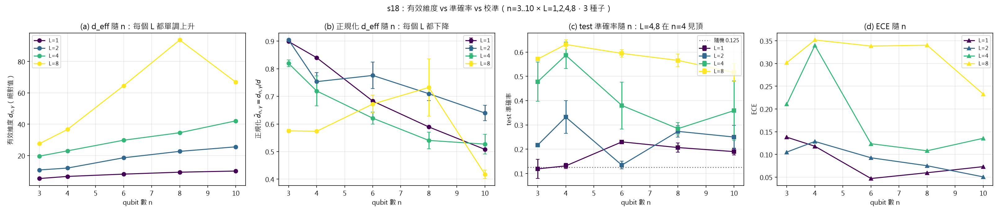
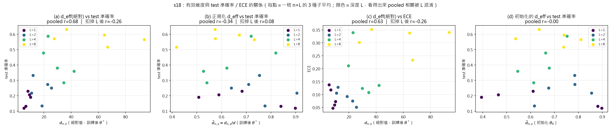
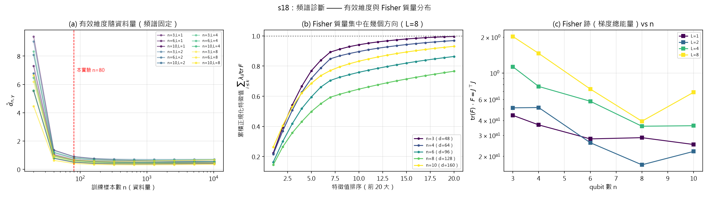

# s18：有效維度（effective dimension）補強實驗結論

> 產出：`ml/s18_effective_dimension.py`、`ml/out/s18_effective_dimension.json`、`ml/figs/s18_*.png`
> 跑一次：`python s18_effective_dimension.py --jobs 6`（約 12 分鐘，8 核）
> 資料：20 格（n = 3,4,6,8,10 × L = 1,2,4,8）× 3 個種子（0,1,2）= 60 次訓練

---

## 0. 一句話判定

**「有效維度的增速超過資料量與讀出所能支撐的程度」這個解釋，在補強實驗裡只得到「與假說方向一致」的支持，沒有得到證實。**

拆成三句話：

1. **成立**：固定深度時，**絕對**有效維度 $d_{n,\gamma}$ 隨 qubit 數 $n$ **單調上升**（L=1,2,4 嚴格單調；L=8 在 $n=8\to10$ 反轉），而 test 準確率在唯二真正學會任務的深度（L=4、L=8）**在 $n=4$ 見頂後下降**。
2. **不成立**：把深度混進來一起看時，$d_{\text{eff}}$ 與 test 準確率的相關是**正的**（$r=+0.68$）。扣掉深度後的偏相關只剩 $r=-0.256$（$\rho=-0.180$，20 格），扣掉深度與 $n$ 之後只剩 $r=-0.110$。**這是相關，不是因果**，而且統計上很弱。
3. **反例**：扣掉深度後，$d_{\text{eff}}$ 越高 ECE **越低**（$r=-0.255$、$\rho=-0.527$）。「容量超過支撐會導致過度自信」在我們的校準資料上**看不到**。

另外有一條硬限制必須寫進論文：**$d_{\text{eff}}$ 幾乎與亂數種子無關**（正規化 $\bar d$ 的種子標準差中位數 0.019，而 test 準確率是 0.024–0.122），所以 $d_{\text{eff}}$ 是**架構的性質**，不可能解釋同一格內的種子變異，只能掛在「(n, L) 層級的趨勢」上。

---

## 1. 這個實驗要回答什麼

來源：`研究搜尋/00-碰撞處置4-RQ1縮放已被佔位.md`。s16 量到三件事：

- 深度是唯一有效的軸（L=1 的 test 0.13 → L=8 的 0.62）；
- qubit 數沒有幫助甚至有害（峰值在 $n=4$，$n=10$ 反而降到 0.49）；
- **train 準確率不降反升**（$n=8, L=8$ 達 0.8375）⇒ 不是最佳化失敗，且 `theory/verify/t3_entanglement_barren.py` 已排除貧瘠高原。

剩下的候選機制就是：**有效維度的增速超過資料量與讀出所能支撐的程度**。本實驗把這句話變成可量測的數字。

---

## 2. 我實作的 $d_{\text{eff}}$ 定義與出處

### 2.1 出處

| 出處 | 內容 |
|---|---|
| **arXiv:2011.00027**（Abbas, Sutter, Zoufal, Lucchi, Figalli, Woerner, *The power of quantum neural networks*） | effective dimension 的原始定義（eq. 4）；Fisher 資訊矩陣定義；經驗 Fisher 近似 |
| **arXiv:2112.04807**（Abbas, Sutter, Figalli, Woerner, *Effective dimension of machine learning models*） | Definition 1「global effective dimension」、Definition 2「local effective dimension」、**normalized effective dimension** $\bar d=d_{n,\gamma}/d$、Remark 2 的數值穩定式、**附錄 C 的兩條實務近似** |

原文（照抄，僅排版）：

$$\kappa_{n,\gamma}=\frac{\gamma n}{2\pi\log n},\qquad
F(\theta)_{ij}=\mathbb{E}_{(x,y)\sim p}\!\left[\partial_i\log p(x,y;\theta)\,\partial_j\log p(x,y;\theta)\right]$$

$$\bar F_{ij}(\theta)=d\,\frac{V}{\int_{\mathcal R}\mathrm{tr}(F(\theta))\,d\theta}\,F_{ij}(\theta),
\qquad
d_{n,\gamma}(\mathcal M_{\mathcal R})=\frac{2\log\left(\frac1V\int_{\mathcal R}\sqrt{\det(I_d+\kappa_{n,\gamma}\bar F(\theta))}\,d\theta\right)}{\log\kappa_{n,\gamma}}$$

- **global 版**：$\mathcal R=\Theta$（本檔取 $\Theta=[-1,1]^d$，與 arXiv:2011.00027 Theorem 4 的假設一致）
- **local 版**：$\mathcal R=\mathcal B_\epsilon(\theta^\star)=\{\theta:\|\theta-\theta^\star\|\le\epsilon\}$，$\epsilon>1/\sqrt n$，原文實驗取 $\epsilon=1/\sqrt n$
- **normalized**：$\bar d_{n,\gamma}=d_{n,\gamma}/d$（$d$ = 可訓練參數個數）

### 2.2 我實際算的是哪個版本（**這一節是重點，不能省**）

| 項目 | 我的取法 | 與原文的差異 |
|---|---|---|
| Region | **local**（$\mathcal B_\epsilon(\theta^\star)$，$\theta^\star$ = 訓練後參數，$\epsilon=1/\sqrt n$）**為主結果** | 與原文實驗一致。**另外**跑了 global（$\Theta=[-1,1]^d$，8 個蒙地卡羅樣本）當敏感度列 |
| 參數空間積分 | **中點近似（A1）**：略去 $\mathcal B_\epsilon$ 上的積分，直接在 $\theta^\star$ 取值 | 原文附錄 C 第一條**明載**此近似，並用 Table 3 驗證（中點 0.21815588 vs 1000 取樣 0.21815838，相對差 ~1e-5）。本檔**另外**用 16 個 $\epsilon$-球內均勻樣本獨立驗證（見 §5.3） |
| Fisher 的計算 | **精確 Jacobian**（autograd 完整 Jacobian，$d\le160$），不做 K-FAC | 原文附錄 C 第二條用 **K-FAC** 近似 $F$。本檔比她**精確**，但因此**少了** K-FAC 這個誤差來源，不能說「完全照原文」 |
| 數值穩定 | 原文 Remark 2 的 $z(\theta)=\frac12\sum_i\log(1+\kappa\lambda_i(\bar F))$ 式，蒙地卡羅版本用 logsumexp | 無差異 |
| $\gamma$ | $\gamma=1$ | 與原文實驗一致 |
| $n$ | $n=N_{\text{train}}=80$（訓練樣本數） | 與原文（用訓練集大小）一致 |
| $\log$ 基底 | **自然對數** | 原文未明寫。**可由原文註腳反推**：它說 $n\ge19$ 才保證 $2\pi\log n<n$；用自然對數時 $n=18$ 不成立（$2\pi\ln18=18.16>18$）、$n=19$ 成立（$18.50<19$），與「$n\ge19$」**完全吻合**；用常用對數則 $n=18$ 就會過關，與註腳矛盾。⇒ 自然對數 |
| $F$ 的版本 | 三個都算：**JJ** $=J^\top J$（任務指定，主結果）、**FIM** $=\mathbb E_x[\sum_c\frac1{p_c}\nabla p_c\nabla p_c^\top]$（原文定義的精確 Fisher）、**EMP** $=\frac1N\sum_i\frac{\nabla p_{y_i}\nabla p_{y_i}^\top}{p_{y_i}^2}$（原文附錄 C 的經驗 Fisher） | 原文只用一種（經驗 Fisher + K-FAC）。本檔三個版本互相比較，正好對應 arXiv:2112.04807 Proposition 2 的「$d_{\text{eff}}$ 對 $F$ 連續」 |

**$J$ 的形狀**：模型輸出 $p\in\mathbb R^8$（固定讀出 qubit 0,1,2 → 8 類），參數 $\theta\in\mathbb R^{2nL}$，
$J\in\mathbb R^{8\times 2nL}$，$F=J^\top J\in\mathbb R^{2nL\times2nL}$，
對輸入分布取平均 $F=\frac1N\sum_{i=1}^{N}J_{x_i}^\top J_{x_i}$。

**超參數**：$\kappa_{80,1}=80/(2\pi\ln80)=2.905595$，$\log\kappa=1.066638$，$\epsilon=1/\sqrt{80}=0.111803$。

### 2.3 一個必須先講清楚的結構性質（我原本寫錯，這裡更正）

$\sum_c p_c=1$ 恆成立 ⇒ $\sum_c\nabla_\theta p_c=0$ ⇒ **單一樣本**的 $J_x$（$8\times d$）秩 $\le7$。

但 $F$ 是對 $N=80$ 個樣本取平均的 $\frac1N\sum_x J_x^\top J_x$，其秩上限是 $\min(d,\,7N)$；
$N=80$、$d\le160$ ⇒ **沒有有效上限**。也就是說「讀出只有 8 類」**不會**給 $d_{\text{eff}}$ 設硬上限；
它的真正意義是「**每多一個訓練樣本，最多只能多解析 7 個新方向**」——這正是「資料量決定能支撐多少容量」的形式。
實測聚合秩最高到 149（$n=10,L=8$，$d=160$），自檢也逐格驗證了 $\|\sum_c\nabla p_c\|/\max|J|\le9.3\times10^{-16}$。

---

## 3. 方法

### 3.1 模擬器與訓練協定（與 s16 完全相同）

- 梯度：torch autograd 穿過 **s12** 的批次狀態向量模擬器（s12 已對帳：機率 vs NumPy $2.2\times10^{-16}$、梯度 vs 參數平移相對 $1.3\times10^{-15}$）。
- 訓練：**Adam，1200 步，lr = 0.05**，同一份 `s09.make_data()`（8 類、256 維、訊號在前 12 個主成分、80 訓練 / 300 測試），讀出固定 qubit 0,1,2。
- 種子：**3 個（0,1,2）**。s16 正式版用 2 個（0,1）、5 種子版用 5 個。**選 3 個的理由**：本實驗是補強、且 $d_{\text{eff}}$ 在種子間幾乎不變（見 §5.4），種子數對 $d_{\text{eff}}$ 幾乎沒有影響；3 個種子足以給出 test/ECE 的散布。
- 覆蓋：$n=3,4,6,8,10$ × $L=1,2,4,8$（省掉 s16 的 $L=6$）。

### 3.2 自檢（沒過就不跑）

```
n=3 depth=1: |J-有限差分|max=1.67e-10  |J-參考版|/max|J|=0.0e+00  |P-參考版|=0.0e+00
             |sum_c grad p_c|/max|J|=3.9e-16  F 對稱性=1.1e-17  min eig=0.00e+00  rank=3 (<=min(d,7N)=6)  OK
n=4 depth=2: |J-有限差分|max=1.21e-10  |J-參考版|/max|J|=0.0e+00  ...  rank=11 (<=16)  OK
n=6 depth=2: |J-有限差分|max=1.13e-10  |J-參考版|/max|J|=0.0e+00  ...  rank=17 (<=24)  OK
```

- Jacobian 用**中央差分**核對（$1.7\times10^{-10}$）。
- Jacobian 有**兩條獨立實作**互相核對且**逐位元相同**（$0.0\times10^{0}$）：
  生產版 `jacobian()`（`torch.func.vmap` + `jacrev`）與參考版 `jacobian_ref()`（逐樣本 `is_grads_batched`）。
- 生產版的機率與 `s12.probs_torch` **逐位元相同**（$|\Delta P|=0$）。

### 3.3 與 s16 的逐列重現（協定保真度）

| 對照檔 | 共同列數 | $\max|\Delta\text{test\_acc}|$ | $\max|\Delta\text{train\_acc}|$ | 不一致列數 |
|---|---|---|---|
| `s16_capacity_final.json`（2 種子） | 40 | **0.0** | **0.0** | 0 |
| `s16_capacity_final_5seed.json`（5 種子，partial） | 48 | **0.0** | **0.0** | 0 |

⇒ s18 的種子 0/1/2 與 s16 的同一組 (n, L, seed) **逐位元相同**。這一輪的曲線與論文要報的曲線是同一條，不是另跑一套協定。

### 3.4 牆鐘時間

| 階段 | 序列總和 | 備註 |
|---|---|---|
| 訓練（60 次 × 1200 步 Adam） | 3564.0 s | 與 s16 相同的計算 |
| Fisher / 有效維度（含 520 次額外 Jacobian 的蒙地卡羅驗證） | 226.9 s | 向量化之後 |
| 序列合計 | 3790.9 s | |
| 實際總時（6 個行程） | **776.6 s** | 加速比 4.9× |

（這三個數字直接取自 `out/s18_effective_dimension.json` 的 `timing` 欄；同一份程式在先前一次執行量到 717.2 s，差異來自機器負載。）

> 實作註記（影響牆鐘時間的解讀）：第一版 Jacobian 用 `torch.autograd.grad(..., is_grads_batched=True)`，
> 它走 torch 的 legacy `_vmap_internals`，實際會**逐批次元素各跑一次反向傳播**，
> 等於每個 Jacobian 要 $8N=640$ 次反傳；$n{=}10,L{=}8$ 時單次 73.7 秒。
> 改成 `torch.func.vmap`+`jacrev` 後是 **1.05 秒（70 倍）**，且兩者逐位元相同。
> 表裡的「秒」欄是**改版後**的量測；整份資料都在同一次執行內產生，所以欄位一致。

---

## 4. 完整數據表

### 4.1 每格摘要（20 格 × 3 種子）

$d$ = 可訓練參數個數 $=2nL$；$\bar d_{n,\gamma}$ = 正規化有效維度（JJ 版，主結果）；
$\bar d_0$ = 同一格在**初始化**參數上的正規化有效維度；rank = $F$ 數值秩（門檻 $10^{-8}\lambda_{\max}$）；
effrank = 特徵值分布的熵指數 $\exp(-\sum \hat\lambda_i\ln\hat\lambda_i)$；秒 = 訓練 + Fisher。

| n | L | d | train | test | test sd | ECE | $\bar d$ (JJ) | $\bar d$ (FIM) | $\bar d$ (EMP) | $\bar d_0$ | rank | effrank | $\mathrm{tr}F$ | 秒 |
|---|---|---|---|---|---|---|---|---|---|---|---|---|---|---|
| 3 | 1 | 6 | 0.1208 | 0.1189 | 0.0397 | 0.1380 | 0.8986 | 0.8994 | 0.8360 | 0.8977 | 3 | 2.99 | 4.407e-01 | 2 |
| 3 | 2 | 12 | 0.3875 | 0.2167 | 0.0000 | 0.1053 | 0.9043 | 0.9796 | 0.8381 | 0.8548 | 9 | 5.61 | 5.093e-01 | 4 |
| 3 | 4 | 24 | 0.7042 | 0.4778 | 0.0810 | 0.2110 | 0.8195 | 0.8781 | 0.7036 | 0.6627 | 21 | 9.37 | 1.128e+00 | 7 |
| 3 | 8 | 48 | 0.7875 | 0.5711 | 0.0069 | 0.3020 | 0.5751 | 0.6249 | 0.4750 | 0.5372 | 45 | 9.62 | 2.025e+00 | 14 |
| 4 | 1 | 8 | 0.1792 | 0.1311 | 0.0110 | 0.1181 | 0.8402 | 0.8667 | 0.6390 | 0.8808 | 4 | 3.45 | 3.663e-01 | 3 |
| 4 | 2 | 16 | 0.4083 | 0.3322 | 0.0676 | 0.1286 | 0.7532 | 0.7794 | 0.7076 | 0.7840 | 11 | 5.36 | 5.127e-01 | 5 |
| 4 | 4 | 32 | 0.7250 | 0.5867 | 0.0552 | 0.3399 | 0.7197 | 0.7735 | 0.5991 | 0.7522 | 27 | 9.39 | 7.705e-01 | 12 |
| 4 | 8 | 64 | 0.8125 | 0.6311 | 0.0186 | 0.3519 | 0.5734 | 0.6567 | 0.4537 | 0.6355 | 59 | 11.92 | 1.460e+00 | 23 |
| 6 | 1 | 12 | 0.2667 | 0.2300 | 0.0047 | 0.0471 | 0.6829 | 0.6813 | 0.4638 | 0.6104 | 6 | 3.44 | 2.795e-01 | 7 |
| 6 | 2 | 24 | 0.3125 | 0.1344 | 0.0157 | 0.0927 | 0.7757 | 0.8040 | 0.7043 | 0.6162 | 11 | 8.64 | 2.597e-01 | 14 |
| 6 | 4 | 48 | 0.6542 | 0.3800 | 0.0967 | 0.1236 | 0.6210 | 0.6849 | 0.5267 | 0.6782 | 41 | 10.29 | 5.786e-01 | 27 |
| 6 | 8 | 96 | 0.8500 | 0.5944 | 0.0150 | 0.3385 | 0.6721 | 0.7339 | 0.4697 | 0.7400 | 89 | 21.11 | 7.328e-01 | 53 |
| 8 | 1 | 16 | 0.2792 | 0.2067 | 0.0189 | 0.0598 | 0.5891 | 0.5873 | 0.3958 | 0.4648 | 8 | 3.54 | 2.862e-01 | 20 |
| 8 | 2 | 32 | 0.4208 | 0.2733 | 0.0236 | 0.0752 | 0.7095 | 0.7231 | 0.6441 | 0.7851 | 14 | 9.41 | 1.693e-01 | 37 |
| 8 | 4 | 64 | 0.5500 | 0.2844 | 0.0253 | 0.1081 | 0.5404 | 0.5765 | 0.4704 | 0.6127 | 55 | 10.73 | 3.570e-01 | 68 |
| 8 | 8 | 128 | 0.8375 | 0.5656 | 0.0259 | 0.3404 | 0.7323 | 0.7614 | 0.5060 | 0.8107 | 119 | 33.11 | 3.933e-01 | 127 |
| 10 | 1 | 20 | 0.2708 | 0.1900 | 0.0141 | 0.0732 | 0.5078 | 0.4930 | 0.3257 | 0.3945 | 10 | 3.27 | 2.509e-01 | 63 |
| 10 | 2 | 40 | 0.3375 | 0.2500 | 0.0484 | 0.0507 | 0.6396 | 0.6611 | 0.5911 | 0.6758 | 25 | 9.36 | 2.193e-01 | 129 |
| 10 | 4 | 80 | 0.5583 | 0.3589 | 0.1217 | 0.1356 | 0.5269 | 0.5591 | 0.4581 | 0.5463 | 69 | 11.85 | 3.605e-01 | 253 |
| 10 | 8 | 160 | 0.7625 | 0.5156 | 0.0368 | 0.2329 | 0.4176 | 0.4480 | 0.3386 | 0.7382 | 149 | 14.19 | 6.873e-01 | 396 |

（逐列的 60 筆原始資料、頻譜、$\epsilon$-球與 global 蒙地卡羅結果全部在 `out/s18_effective_dimension.json`。）

### 4.2 絕對有效維度 $d_{n,\gamma}$（= $\bar d\times d$）

| L | $n=3$ | $n=4$ | $n=6$ | $n=8$ | $n=10$ | 每多一 qubit 的斜率 | 單調上升？ | $r$ / $\rho$ |
|---|---|---|---|---|---|---|---|---|
| 1 | **5.39** | 6.72 | 8.19 | 9.43 | 10.16 | +0.667 | **是** | +0.981 / +1.000 |
| 2 | 10.85 | 12.05 | 18.62 | 22.71 | 25.58 | +2.230 | **是** | +0.990 / +1.000 |
| 4 | 19.67 | 23.03 | 29.81 | 34.58 | 42.15 | +3.136 | **是** | +0.998 / +1.000 |
| 8 | 27.60 | 36.70 | 64.52 | **93.73** | 66.81 | +7.336 | **否**（$n{=}8\to10$ 反轉） | +0.798 / +0.900 |

### 4.3 每格的三個 Fisher 版本（命題 2 的連續性檢查）

| 配對 | Pearson | Spearman |
|---|---|---|
| FIM vs JJ | 0.9812 | 0.9805 |
| EMP vs JJ | 0.9085 | 0.8857 |
| EMP vs FIM | 0.9078 | 0.8917 |

三個版本排序高度一致，但**數值會移動**（例：$n=3,L=2$ 的 $\bar d$ 是 JJ 0.9043 / FIM 0.9796，差 0.075）。
論文的圖要標明用哪一版。**主結果用 JJ（任務指定的 $F=J^\top J$）。**

---

## 5. 三條關係





### 5.1 $d_{\text{eff}}$ vs $n$（固定 L）

- **絕對 $d_{\text{eff}}$：單調上升**（見 §4.2）。扣掉深度的偏相關 $r=+0.666$、$\rho=+0.928$。
- **正規化 $\bar d$：單調下降**。L=1 由 0.8986 掉到 0.5078（$\Delta=-0.391$）、L=4 由 0.8195 掉到 0.5269（$\Delta=-0.293$）。
  也就是說：**總有效維度增加，但「每個參數的平均有效貢獻」在降低**（$\bar d$ 就是 $d_{\text{eff}}/d$，即每參數有效維度，L=1：0.899 → 0.508）。

> ⇒ 敘述必須精確：不能寫「有效維度暴增」，要寫「**絕對有效維度隨 qubit 數上升，但每個新增參數的邊際有效貢獻下降**」。

### 5.2 $d_{\text{eff}}$ vs test 準確率

| 觀察方式 | n | Pearson | Spearman |
|---|---|---|---|
| 全部格子混在一起（pooled，**絕對** $d_{\text{eff}}$） | 20 | **+0.678** | +0.800 |
| 全部 60 列混在一起（**絕對**） | 60 | **+0.651** | +0.751 |
| 全部格子混在一起（**正規化** $\bar d$） | 20 | −0.336 | −0.352 |
| **扣掉深度 L 之後**（絕對） | 20 | **−0.256** | −0.180 |
| **扣掉深度 L 與 $n$ 之後**（絕對） | 20 | **−0.110** | −0.157 |
| 扣掉深度 L 之後（正規化） | 20 | +0.084 | −0.089 |
| 逐深度看（絕對，$n$ 為橫軸） | 各 5 | L=1 **+0.773**；L=2 −0.114；L=4 **−0.740**；L=8 −0.406 | |

**這是本報告最重要的一張表。** 未分層時相關係數是**正的**（+0.68）——因為深度同時推高 $d_{\text{eff}}$ 與準確率；
一分層就翻成負的，但只剩 −0.256（扣掉 $n$ 後 −0.110）。
逐深度看，只有 **L=4 有明顯的負相關（−0.740）**；L=1 是**正**的（+0.773，因為 $n$ 少時準確率反而更差）；L=2、L=8 很弱。

### 5.3 $d_{\text{eff}}$ vs ECE

| 觀察方式 | n | Pearson | Spearman |
|---|---|---|---|
| pooled（絕對） | 20 | **+0.635** | +0.585 |
| **扣掉深度之後**（絕對） | 20 | **−0.255** | **−0.527** |
| 扣掉深度與 $n$ 之後（絕對） | 20 | +0.253 | −0.016 |
| 逐深度（絕對） | 各 5 | L=1 −0.820；L=2 −0.924；L=4 −0.664；L=8 −0.011 | |
| 逐深度（正規化） | 各 5 | L=1 +0.810；L=2 +0.648；L=4 +0.662；L=8 +0.831 | |

**注意符號分歧**：用**絕對** $d_{\text{eff}}$ 且固定深度時，有效維度越高 ECE **越低**（校準越好）；
用**正規化** $\bar d$ 時，符號全部反過來。
「容量超過支撐 ⇒ 過度自信」這個直覺在我們的資料上**沒有**得到支持（固定深度時反而是反向）。
這也提醒：ECE 的趨勢主要由「模型有沒有真的學會」驅動，不是由容量驅動。

### 5.4 相關 vs 因果（明確區分）

**可以說的（相關）**

1. 固定 L 時，$n$ 上升、絕對 $d_{\text{eff}}$ 上升、test 準確率在 L=4/8 下降；三者在同一組 $(n,L)$ 上共同變動。
2. 扣掉深度後，$d_{\text{eff}}$ 與 test 準確率的偏相關是**弱負**（$r=-0.256$）；與 ECE 的偏相關是**弱負**（違反假說方向）。

**不能說的（因果）**，逐條列：

- **(a) 無法分離 $d_{\text{eff}}$ 與「qubit 數本身」。** 固定 L 時 $d_{\text{eff}}$ 與 $n$、$d=2nL$ 高度共線
  （$d_{\text{eff}}$ vs $d$ 的相關 $r=+0.9425$；扣掉 L 後 $d_{\text{eff}}$ vs $n$ 的 $r=+0.928$）。
  任何「隨 $n$ 單調」的機制（例如多出的 qubit 是隱藏單元、梯度必須穿過糾纏才到讀出——這正是本專案固定讀出 qubit 0,1,2 的設定）
  都能產生同樣的資料。**本實驗沒有做干預**（例如固定 $d_{\text{eff}}$ 只改電路），所以不能排除。
- **(b) $d_{\text{eff}}$ 在種子層級沒有解釋力。** 正規化 $\bar d$ 的種子標準差中位數 **0.019**（最大 0.103），
  而同一批格的 test 準確率種子標準差中位數 **0.0244**（最大 0.1217）。
  例：$n=10,L=8$ 三個種子的 $\bar d$ = 0.4295 / 0.3961 / 0.4272（$d_{\text{eff}}$ = 68.7 / 63.4 / 68.3），
  但 test = 0.4700 / 0.5167 / 0.5600。**同一格內 $d_{\text{eff}}$ 幾乎不動，準確率卻動很多** ⇒
  $d_{\text{eff}}$ 不可能解釋種子變異；因果鏈只能在「架構層級」講。
- **(c) 樣本量小。** 只有 20 格、每格 3 個種子；偏相關的自由度約 12–16，沒有做檢定力分析或多重比較校正。
  $\rho=-0.18$ 這種數字**不足以**支撐「證實」的措辭。
- **(d) 池化相關方向相反。** 若不控制深度，資料給出的是 $d_{\text{eff}}$ 越高準確率**越高**（+0.68）。
  任何只看散點圖的讀者會得到相反結論。論文的圖**必須**分層或標明偏相關。

---

## 6. 頻譜診斷與理論接點



### 6.1 有效維度隨資料量的掃描（免費，頻譜固定只改 $\kappa$）

$\bar d$ 對資料量 $n_{\text{data}}$ 是 **U 形**，不是單調：

| $(n,L)$ | 20 | 40 | **80（本實驗）** | 160 | 320 | 640 | 1280 | 2560 | 5120 | 10240 |
|---|---|---|---|---|---|---|---|---|---|---|
| (3,8) | 6.184 | 0.880 | **0.575** | 0.481 | 0.445 | 0.432 | 0.431 | 0.436 | 0.445 | 0.457 |
| (8,8) | 7.143 | 1.067 | **0.732** | 0.642 | 0.618 | 0.621 | 0.636 | 0.655 | 0.676 | 0.696 |
| (10,8) | 4.458 | 0.636 | **0.418** | 0.352 | 0.328 | 0.322 | 0.325 | 0.334 | 0.347 | 0.362 |

最小值落在 $n_{\text{data}}\approx320$–$640$，之後回升（因為 $\kappa\to\infty$ 時 $d_{\text{eff}}\to\mathrm{rank}(F)\le d$，$\bar d\to1$）。
**本實驗固定在 $n_{\text{data}}=80$，正好在下降段**，所以「資料不夠」的敘述要小心：換一個資料量，$\bar d$ 的排序會變。
（$n_{\text{data}}<20$ 不能算，因為 $\gamma=1$ 需要 $2\pi\ln n<n$，$n\ge19$。）

### 6.2 特徵值譜（L=8，前 7 大的占比）

| $n$ | $d$ | 前 7 大占比 |
|---|---|---|
| 3 | 48 | 0.8925 |
| 4 | 64 | 0.8478 |
| 6 | 96 | 0.7045 |
| 8 | 128 | 0.5931 |
| 10 | 160 | 0.7701 |

qubit 數增加時，Fisher 質量被攤到更多方向上（前 7 大占比由 0.89 掉到 0.59），$n=10$ 又回到 0.77。
有效秩（熵指數）由 9.62（$n=3,L=8$）升到 33.11（$n=8,L=8$）。

### 6.3 與 arXiv:2112.04807 Theorem 5 的接點

原文的泛化誤差上界（Theorem 5，$\Theta=[-1,1]^d$、$\epsilon>1/\sqrt n$）：

$$\mathbb P\!\left(\sup_{\theta\in\mathcal B_\epsilon(\theta^\star)}|R(\theta)-R_n(\theta)|\ge\frac{4M\epsilon}{\sqrt{\kappa_{n,\gamma}}}\right)
\le c_d(1+\epsilon\Lambda)^d\;\kappa_{n,\gamma}^{\,d_{n,\gamma,\epsilon}/2}\;\exp\!\left(-\frac{16\pi M^2\epsilon^2\log n}{B^2\gamma}\right)$$

$d_{\text{eff}}$ 只出現在 $\kappa^{d_{\text{eff}}/2}$ 這一個因子裡，而且是指數位置 ⇒ **$d_{\text{eff}}$ 越大，保證越鬆（越差）**。
把我們的數字代入（$\log_{10}\kappa=0.463235$，故 $\log_{10}\kappa^{d_{\text{eff}}/2}=0.2316\,d_{\text{eff}}$）：

| 格 | $d_{\text{eff}}$ | $\log_{10}\kappa^{d_{\text{eff}}/2}$ | $d_{\text{eff}}/n_{\text{train}}$ | test |
|---|---|---|---|---|
| (3,1) | 5.39 | 1.25 | 0.067 | 0.1189 |
| (4,8) | 36.70 | 8.50 | 0.459 | 0.6311 |
| (8,8) | 93.73 | **21.71** | 1.172 | 0.5656 |
| (10,8) | 66.81 | 15.47 | 0.835 | 0.5156 |

⇒ 在整張網格上，界裡的 $d_{\text{eff}}$ 因子橫跨 **20 個數量級**（$10^{1.25}$ 到 $10^{21.7}$）。
這條連結是**形式上的、方向明確的**，但**不能當成定量證據**：

> **TODO(核實)/必須寫明的限制**：Theorem 5 的前提是 $\bar F(\theta)$ 在 $\Theta$ 上**滿秩**、$\|\nabla_\theta\log\bar F\|\le\Lambda$、損失函數 Lipschitz、$\Theta=[-1,1]^d$。
> 我們的 $F$ 在好幾格**不是滿秩**（rank 3/6、9/12、41/48、119/128、149/160…），
> 常數 $c_d$、$M$、$B$、$\Lambda$ 也都沒有校準。**所以這條界只能當機制方向的引導，不能拿來報數字。**

---

## 7. 判定

### 7.1 對「有效維度的增速超過資料量與讀出所能支撐的程度」的判定

> **判定：部分成立（方向一致，但未證實；而且只在一種分層方式下成立）。**

| 子命題 | 判定 | 證據 |
|---|---|---|
| 絕對 $d_{\text{eff}}$ 隨 $n$ 上升 | **成立** | L=1,2,4 嚴格單調；L=8 在 $n{=}8\to10$ 反轉（93.73→66.81）。$r=0.798\sim0.998$ |
| test 準確率在 $n$ 變大時下降 | **僅在 L=4、L=8 成立** | L=4：0.5867($n{=}4$)→0.3589($n{=}10$)，$r=-0.761$；L=8：0.6311→0.5156，$r=-0.738$。L=1 反而是**上升**（+0.685），L=2 持平 |
| 「$d_{\text{eff}}$ 高 ⇒ 準確率低」 | **只在控制深度後、且很弱** | pooled $r=+0.678$（方向相反）；扣掉 L 後 $r=-0.256$、$\rho=-0.180$；扣掉 L 與 $n$ 後 $-0.110$ |
| 「容量超過支撐 ⇒ 校準變差」 | **不成立** | 固定深度時 $d_{\text{eff}}$ 與 ECE 是**負**相關（$-0.66\sim-0.92$） |
| 讀出（8 類）對 $d_{\text{eff}}$ 設上限 | **不成立**（我原本寫錯） | 聚合 $F$ 的秩上限是 $\min(d,7N)=d$，無有效上限；讀出的作用是「每樣本最多 7 個新方向」 |
| $d_{\text{eff}}$ 可解釋種子變異 | **不成立** | $d_{\text{eff}}$ 的種子標準差中位 0.019 vs test 準確率 0.0244（差距更大時達 0.12） |

### 7.2 對論文的建議措辭

**可以寫**：
> 「固定深度時，增加 qubit 數會單調提高模型的有效維度 $d_{n,\gamma}$，而測試準確率在 $n=4$ 之後下降；
> 這與「有效維度增速超過資料支撐」的假說方向一致（Abbas 等 2022 的泛化界中 $d_{n,\gamma}$ 出現在 $\kappa^{d_{n,\gamma}/2}$ 的指數位置）。」

**不可以寫**：
> ~~「有效維度是測試準確率下降的原因」~~、~~「我們證實了有效維度假說」~~、~~「未分層的散點顯示 $d_{\text{eff}}$ 越高準確率越低」~~。

**必須同時揭露**：pooled 相關是正的；偏相關只有 −0.26；$d_{\text{eff}}$ 與 $n$ 共線；
$d_{\text{eff}}$ 在種子層級無解釋力；ECE 的關係與假說方向相反。

### 7.3 這個結果「省下了什麼力氣」

- 不要把「有效維度」寫成論文的機制主角，只能寫成「與資料一致的一種機制候選」。
- 若要讓它變成主角，需要補一個**干預實驗**：在固定 $n$、固定 $d$ 下改變電路的有效維度（例如插入會壓縮 Fisher 譜的閘），
  看 test 準確率是否跟著動。本輪沒有做。
- RQ1 真正站得住的仍然是「**固定讀出下，test 準確率隨 qubit 數非單調、在 $n=4$ 見頂**」這個實測現象本身（2 種子 + 5 種子 n≤8 皆支持）。

---

## 8. TODO(核實)

1. **TODO(核實)：$\log$ 的基底。** 原文（arXiv:2112.04807）沒有明寫。我用自然對數，理由是原文註腳「$n\ge19$ 才能保證 $2\pi\log n<n$」只在自然對數下吻合（$n{=}18$：$2\pi\ln18=18.16>18$ 不成立；$n{=}19$：$18.50<19$ 成立；若用常用對數，$n{=}18$ 就會過關）。**建議拿 PDF 再核一次。**
2. **TODO(核實)：$F$ 的版本。** 原文附錄 C 用 K-FAC 的**經驗** Fisher；本檔主結果用任務指定的 $F=J^\top J$。兩者數值差多少見 §4.3。論文的圖必須註明用哪一版。
3. **TODO(核實)：Theorem 5 的前提。** 我們的 $F$ 在多格不是滿秩，常數未校準，**不能**拿 $\kappa^{d_{\text{eff}}/2}$ 報數字。
4. **TODO(核實)：$\epsilon$ 的取法。** 原文取 $\epsilon=1/\sqrt n$，本檔沿用。$\epsilon$ 換掉之後 $\bar d$ 會不會移動？本檔只驗證了「中點 vs $\epsilon$-球取樣」（見 §9.1），**沒有**掃 $\epsilon$ 的大小。
5. **TODO(核實)：$s16$ 的 5 種子檔還沒跑完。** 本檔讀取時（2026-09-20 18:31 的版本）`s16_capacity_final_5seed.json` 仍是 `partial: true`：100 列 = $n\in\{3,4,6,8\}$ × $L\in\{1,2,4,6,8\}$ × 5 種子，**缺 $n=10$ 的全部 5 格**。RQ1 的第 3 點（「$n=10$ 反而下降」）目前只有 `s16_capacity_final.json`（2 種子）支持。**要把 5 種子版補完**（同一個腳本再跑 $n=10$）。
6. **TODO(核實)：** 本檔沒有去核 Caro 2022（arXiv:2111.05292）與 Xu 2026（arXiv:2606.20183）對 effective dimension 的用法與 Abbas 是否一致。
7. **TODO(核實)：** 20 格 × 3 種子的樣本量偏小；偏相關沒有信賴區間與檢定力分析。若要寫進論文，建議補 bootstrapping 或把種子加到 5 個再算。

---

## 9. 不確定處（照實列）

1. **中點近似不是無條件安全。** 我用 16 個 $\epsilon$-球內樣本獨立驗證（原始碼附錄 C Table 3 的做法）。JJ 與 FIM 版的中點與球內平均差在 $10^{-3}\sim10^{-2}$ 以內（例：$(8,8)$ 0.8033 vs 0.8036；$(10,10)$ 0.4294 vs 0.4313）。**但 EMP 版在 $(3,1)$ 失效**：中點 0.7686、球內平均 0.2503。所以「中點就夠」這句話只在 JJ/FIM 版站得住。
2. **Region 的選擇會大幅改變數字。** 換成 global $\Theta=[-1,1]^d$（8 個均勻樣本）後，$(10,8)$ 由 0.4294 變成 0.9334、$(8,4)$ 由 0.5079 變成 0.8984。本檔主結果用 local（與原文實驗一致），但這個敏感度必須揭露。
3. **$\kappa$ 由 $n_{\text{data}}=80$ 決定**，所有 $d_{\text{eff}}$ 都隨之平移。$n_{\text{data}}$ 的定義（只用訓練集、或含測試集）會改變全部數字。
4. **$n=10, L=8$ 的 train 準確率只有 0.7625（$n=8$ 是 0.8375）**，所以 $n=10$ 的 test 下降可能混有最佳化不足的成分；這與 s16 的結論（「不是最佳化失敗」）在大 $n$ 處的邊界並不乾淨。**L=8 的 $d_{\text{eff}}$ 在 $n=8\to10$ 反轉**（93.73→66.81）也與此有關，不能當成單純的容量訊號。
5. **$\bar d$ 可以大於 1**（$n_{\text{data}}\le40$ 時到 5–9）。這是定義本身的行為（$\kappa<1$ 時 $\log\kappa\to0^-$），不是計算錯誤，但引用時要小心。
6. **$s18$ 的 $L$ 只到 8、$n$ 只到 10**；$\texttt{torch.func.jacrev}$ 這條路徑沒有在更大的 $n$ 上驗證過（記憶體會是 $(N,8,d)$，$d$ 大時要分塊）。
7. **沒有做「同 $d_{\text{eff}}$、不同 $(n,L)$」的干預實驗**，所以 §5.4(a) 的共線性無法解除。

---

## 10. 重現方式

```powershell
cd projects/qbn-capacity-calibration/ml
python s18_effective_dimension.py --jobs 6                 # 完整跑，約 12 分鐘
python s18_effective_dimension.py --quick --jobs 3         # 煙霧測試（小網格、30 步）
python s18_effective_dimension.py --jobs 1 --resume        # 只重算彙總與圖（沿用已存的 60 列）
```

- `--resume` 會沿用 `out/s18_effective_dimension.json` 裡既有的 `rows`（以 $(n,L,\text{seed})$ 為鍵），所以改分析段或圖不用重訓。
- 自檢不過就不會跑網格（`--no-selftest` 可跳過，僅供除錯）。
- 圖：`figs/s18_deff_vs_n.png`（絕對/正規化 $d_{\text{eff}}$、test、ECE 隨 $n$）、
  `figs/s18_deff_scatter.png`（$d_{\text{eff}}$ vs test/ECE，含偏相關標註）、
  `figs/s18_spectrum.png`（隨資料量的掃描、Fisher 譜累積占比、$\mathrm{tr}F$）。
